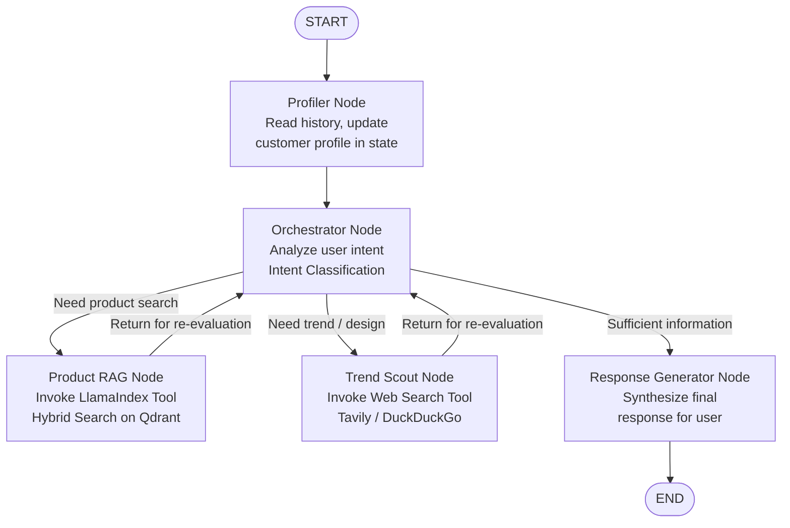

# Agentic RAG Ecommerce
## AI POD Stylist & Recommendation System

---

## 1. Project Overview

**Project Name:** `agentic-rag-ecommerce` — AI POD Stylist & Recommendation System

**Objective:** Build a **Multi-Agent AI Consultant** system integrated with the open-source **Saleor** e-commerce platform. The system acts as a **personal stylist** for the **Print-on-Demand (POD)** industry: it automatically understands user needs, queries matching product blanks from the data store, searches for real-time design trends on the web, and delivers personalized print design suggestions.

**Core Architecture:**
- **Stateful Multi-Agent Workflow** orchestrated by **LangGraph**
- Advanced data processing layer powered by **Agentic RAG** from **LlamaIndex**
- Wrapped by **FastAPI** to expose REST API services and handle Webhooks

---

## 2. Main Features

### User Profiler & Memory Manager
Automatically analyzes conversation history to extract customer information (age, style, print preferences), stores short-term chat sessions and persists long-term customer profiles in **PostgreSQL**.

### Product Agentic RAG Engine
Uses **LlamaIndex** to connect and index the product catalog pulled from the **Saleor GraphQL API** into **Qdrant Vector DB**. Performs **Hybrid Search** combining Semantic Search and Metadata Filtering to find the most contextually relevant product blanks (t-shirts, mugs, canvases).

### Trend Scout & Design Prompt Generator
A dedicated agent uses a **Web Search Tool** (Tavily / DuckDuckGo) to fetch the latest seasonal design trends (e.g., Christmas, Halloween), then automatically generates optimized **Text-to-Image Prompts** to suggest print design ideas to customers.

### Real-time Saleor Data Sync (Webhook)
A FastAPI endpoint listens for `PRODUCT_UPDATED` or `PRODUCT_CREATED` events from Saleor to automatically upsert or delete the corresponding vectors in **Qdrant Vector DB** in real time.

### Token & Event Streaming
Supports streaming responses via **Server-Sent Events (SSE)** through FastAPI, enabling the chat interface to display answers word-by-word in real time.

---

## 3. Tech Stack

| Component | Technology |
|---|---|
| Backend Framework | Python, FastAPI |
| Agent Orchestration | LangGraph (State & Workflow Management), LangChain Primitives |
| Data Layer & RAG | LlamaIndex (Hierarchical Node Parsing & Object Retrievers) |
| Vector Database | Qdrant |
| Relational Database | PostgreSQL |
| Session Cache / Short-term Memory | PostgreSQL |
| E-Commerce System | Saleor Core (Open-source via GraphQL API) |
| DevOps | Docker, Docker Compose |

---

## 4. LangGraph Graph Architecture & State

### AgentState

The system manages state through an `AgentState` object containing the following fields:

| Field | Description |
|---|---|
| `messages` | Full conversation history |
| `user_profile` | Extracted customer profile |
| `optimized_product_query` | Optimized product search query |
| `retrieved_products` | List of matched product blanks |
| `design_suggestions` | Generated print design suggestions |

### Graph Flow Diagram

### Conditional Routing Logic

| Current Node | Condition | Next Node |
|---|---|---|
| START | — | Profiler Node |
| Profiler Node | — | Orchestrator Node |
| Orchestrator Node | Need product search | Product RAG Node |
| Orchestrator Node | Need trend / design search | Trend Scout Node |
| Orchestrator Node | Sufficient information collected | Response Generator Node |
| Product RAG Node | — | Orchestrator Node (re-evaluate) |
| Trend Scout Node | — | Orchestrator Node (re-evaluate) |
| Response Generator Node | — | END |
