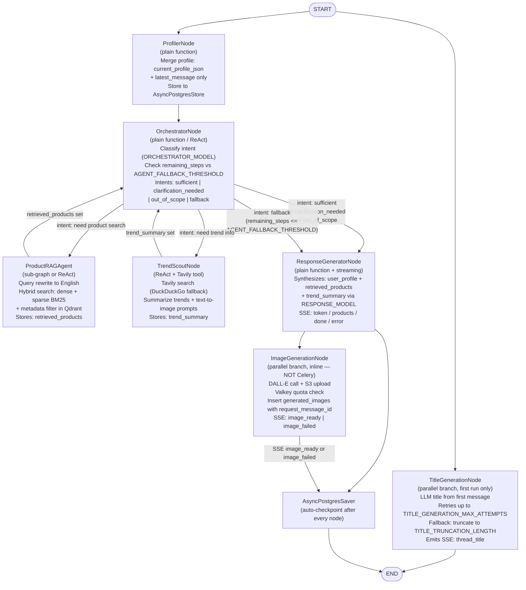

# Agentic RAG Ecommerce
## AI POD Stylist & Recommendation System

---

## 1. Project Overview

**Project Name:** `agentic-rag-ecommerce` — AI POD Stylist & Recommendation System

**Objective:** Build a **Multi-Agent AI Consultant** microservice integrated with the open-source **Saleor** e-commerce platform. The system acts as a **personal stylist** for the **Print-on-Demand (POD)** industry: it understands customer needs via multi-turn conversation, retrieves matching product blanks from a vector catalog, searches for real-time design trends on the web, generates on-demand design images, and delivers personalized print design suggestions — all streamed in real time.

**Core Architecture:**
- **Stateful Multi-Agent Workflow** with 7 nodes orchestrated by **LangGraph** (`AsyncPostgresSaver` + `AsyncPostgresStore`)
- **Thread-based chat API** — `POST /api/v1/threads/{thread_id}/runs/stream` with SSE streaming
- Advanced retrieval layer powered by **LlamaIndex** (hybrid dense + sparse BM25 search on Qdrant)
- **FastAPI** backend exposing 13 REST endpoints and a Saleor webhook receiver
- **Celery + RabbitMQ** for async webhook processing and scheduled cleanup tasks

---

## 2. Main Features

### Thread-based Multi-turn Chat
Customers interact via a thread-based API model. Each thread maintains full conversation state via the LangGraph `AsyncPostgresSaver` checkpointer (all `AgentState` fields + messages persisted per checkpoint). Threads are auto-named from the first message using a dedicated `TitleGenerationNode` and expire after 30 days of inactivity.

### User Profiler & Long-term Memory
The `ProfilerNode` incrementally extracts and merges customer attributes (`age_group`, `style_preferences`, `product_interests`, occasion context) on every chat turn using only `{current_profile_json, latest_message}` — not the full history. Profiles are persisted in **LangGraph Store** (`AsyncPostgresStore`) under namespace `("profiles", user_id)`.

### Product Agentic RAG Engine
The `ProductRAGAgent` uses **LlamaIndex** to index the Saleor product catalog into **Qdrant**. It performs **Hybrid Search** combining dense semantic vectors (`text-embedding-3-small`) and sparse BM25 with metadata filtering (`category`, `price_range`, `available`, `tags`) to find the most contextually relevant product blanks. Search queries are always rewritten in English before hitting Qdrant regardless of the user's language.

### Trend Scout & Design Prompt Generator
The `TrendScoutNode` calls **Tavily** (with **DuckDuckGo** as fallback) to retrieve real-time seasonal design trends, summarizes them into a structured trend report, and generates 3–5 text-to-image prompt suggestions stored in `AgentState.trend_summary`.

### On-demand Design Image Generation
The `ImageGenerationNode` runs as a parallel branch within the LangGraph pipeline when `generate_image: true` is set in the request and design context is available. It calls **OpenAI DALL-E**, uploads the result to **AWS S3**, and emits an `image_ready` SSE event. Per-user daily quotas are enforced via a Valkey counter.

### Real-time Saleor Data Sync (Webhook)
`POST /webhooks/saleor` receives HMAC-SHA256-validated product lifecycle events (`PRODUCT_CREATED`, `PRODUCT_UPDATED`, `PRODUCT_DELETED`) from Saleor and enqueues idempotent **Celery** tasks to upsert or delete vectors in Qdrant.

### SSE Response Streaming
Responses are streamed via **Server-Sent Events** using 7 typed events:

| Event | When Emitted |
|---|---|
| `token` | LLM is streaming text tokens |
| `products` | Product block separator (structured product list) |
| `image_ready` | After S3 upload completes |
| `image_failed` | If image generation fails (`rate_limit_exceeded` or `generation_failed`) |
| `thread_title` | When `TitleGenerationNode` produces a title |
| `done` | End of stream (includes `run_id`, `intent`, token usage, cost) |
| `error` | Any pipeline error |

---

## 3. Tech Stack

| Layer | Technology |
|---|---|
| Language / Runtime | Python 3.12 |
| Web Framework | FastAPI + SSE |
| Agent Orchestration | LangGraph (`AsyncPostgresSaver` + `AsyncPostgresStore`), LangChain primitives |
| LLM Provider | OpenAI (model names via env vars: `RESPONSE_MODEL`, `ORCHESTRATOR_MODEL`, `TITLE_MODEL`) |
| Embedding | OpenAI `text-embedding-3-small` (default), configurable via `EMBEDDING_MODEL` |
| Data Layer & RAG | LlamaIndex (inside LangGraph nodes) |
| Vector Database | Qdrant (hybrid dense + sparse BM25) |
| Relational Database | PostgreSQL 16 (LangGraph checkpointer + custom `threads`, `generated_images` tables) |
| Cache / Rate Limiting | Valkey (DB `/0` rate limiting via `slowapi`, DB `/1` response cache via `fastapi-cache2`) |
| Async Tasks | Celery + RabbitMQ |
| Image Storage | AWS S3 |
| Web Search | Tavily (primary), DuckDuckGo (fallback) |
| Observability | LangSmith + OpenInference (OTel) + Prometheus + Grafana + structlog + Loki |
| E-Commerce System | Saleor (open-source, via GraphQL API + HMAC webhooks) |
| Authentication | Saleor JWT (RS256, verified via cached JWKS) |
| Dependency Management | `uv` + `pyproject.toml` |
| Linting / Formatting | `ruff` |
| Type Checking | `pyright` |
| Testing | `pytest` + `pytest-asyncio` + `pytest-cov` |
| Containerization | Docker + Docker Compose (11 services) |
| CI | GitHub Actions |

---

## 4. LangGraph Graph Architecture & State

### AgentState

The system manages state through an `AgentState` object persisted automatically by `AsyncPostgresSaver` after every node:

| Field | Type | Description |
|---|---|---|
| `messages` | `list[BaseMessage]` | Full conversation history (all turns) |
| `user_profile` | `dict` | Extracted and merged customer attributes |
| `retrieved_products` | `list[ProductItem]` | Qdrant hybrid search results |
| `trend_summary` | `str \| None` | Web-sourced trend report + text-to-image prompts |
| `thread_title` | `str \| None` | Auto-generated or fallback-truncated thread title |
| `correlation_id` | `str` | Per-request traceability ID |

### Graph Flow Diagram

### Conditional Routing Logic

| Current Node | Condition | Next Node |
|---|---|---|
| START | — (parallel) | TitleGenerationNode + ProfilerNode |
| TitleGenerationNode | — | END (parallel branch terminates) |
| ProfilerNode | — | OrchestratorNode |
| OrchestratorNode | intent: `sufficient`, `clarification_needed`, or `out_of_scope` | ResponseGeneratorNode |
| OrchestratorNode | intent: `fallback` (`remaining_steps <= AGENT_FALLBACK_THRESHOLD`) | ResponseGeneratorNode |
| OrchestratorNode | intent: need product search | ProductRAGAgent |
| OrchestratorNode | intent: need trend info | TrendScoutNode |
| ProductRAGAgent | — | OrchestratorNode (re-evaluate) |
| TrendScoutNode | — | OrchestratorNode (re-evaluate) |
| ResponseGeneratorNode | — (parallel) | ImageGenerationNode + AsyncPostgresSaver |
| ImageGenerationNode | — | AsyncPostgresSaver |
| AsyncPostgresSaver | — | END |

---

## 5. API Endpoints

| Method | Path | Description | Auth |
|---|---|---|---|
| `POST` | `/api/v1/threads` | Create a new thread | JWT |
| `GET` | `/api/v1/threads` | List threads for authenticated user (cursor pagination) | JWT |
| `GET` | `/api/v1/threads/{thread_id}` | Get thread metadata | JWT |
| `DELETE` | `/api/v1/threads/{thread_id}` | Delete thread (async, returns 202) | JWT |
| `POST` | `/api/v1/threads/{thread_id}/runs/stream` | Send message; stream SSE response | JWT |
| `GET` | `/api/v1/threads/{thread_id}/history` | Get message history (cursor pagination) | JWT |
| `GET` | `/api/v1/users/{user_id}/profile` | Get customer profile | JWT + `is_staff` |
| `POST` | `/api/v1/admin/reindex` | Trigger full Saleor → Qdrant reindex (async, 202) | JWT + `is_staff` |
| `GET` | `/api/v1/admin/threads` | List all threads (admin) | JWT + `is_staff` |
| `POST` | `/webhooks/saleor` | Receive Saleor product lifecycle events (HMAC-validated) | HMAC |
| `GET` | `/health` | Liveness probe | — |
| `GET` | `/ready` | Readiness probe (checks Qdrant, PostgreSQL, Valkey) | — |
| `GET` | `/metrics` | Prometheus metrics | — |

---

## 6. Infrastructure

### Docker Compose Services (11 services)

| Service | Description |
|---|---|
| `app` | FastAPI application |
| `postgres` | PostgreSQL 16 (LangGraph state + custom tables) |
| `qdrant` | Qdrant vector database |
| `valkey` | Valkey (rate limiting DB `/0`, response cache DB `/1`) |
| `rabbitmq` | RabbitMQ message broker for Celery |
| `celery-worker` | Celery worker (webhook, reindex, cleanup queues) |
| `celery-beat` | Celery Beat scheduler (nightly thread cleanup at 2:00 AM) |
| `prometheus` | Prometheus metrics collection |
| `grafana` | Grafana dashboards (Prometheus + Loki data sources) |
| `loki` | Log aggregation backend |
| `promtail` | Log shipper (scrapes Docker stdout → Loki) |
