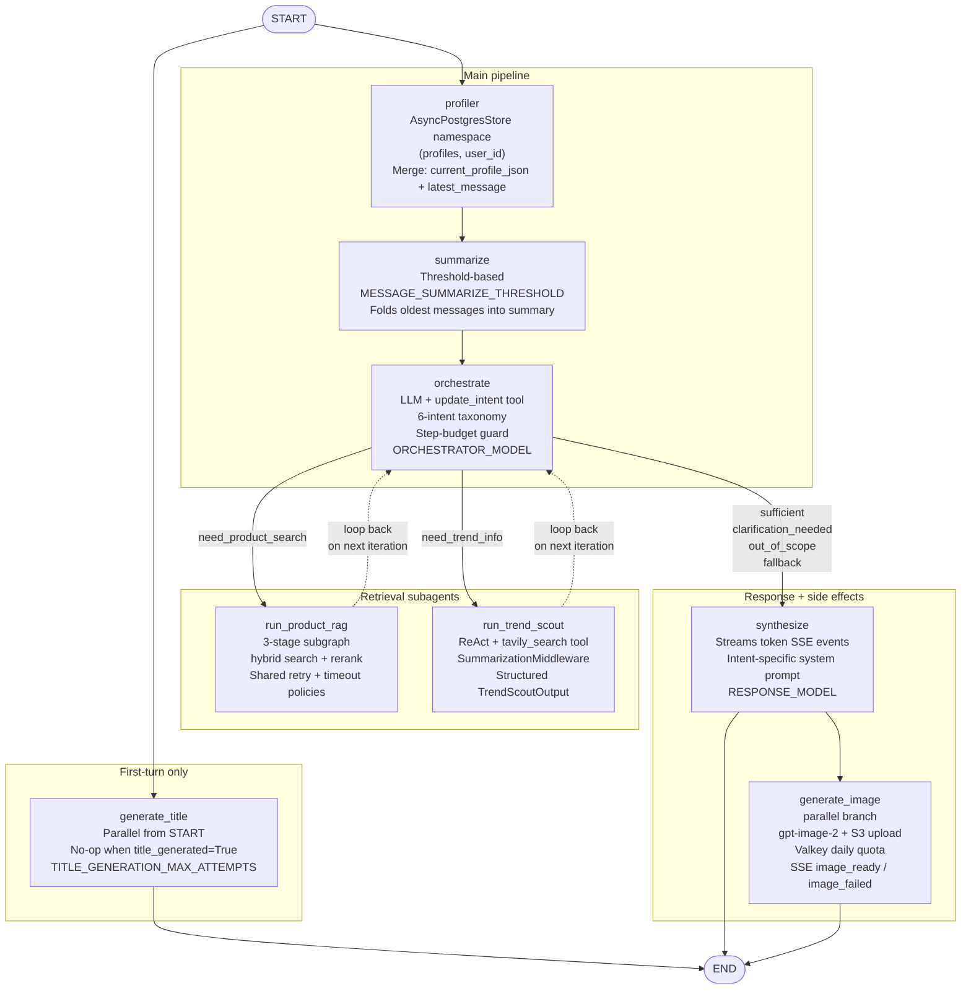
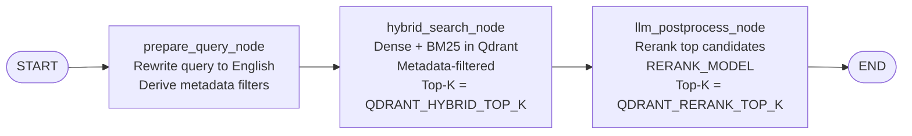
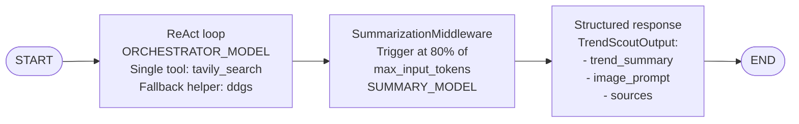
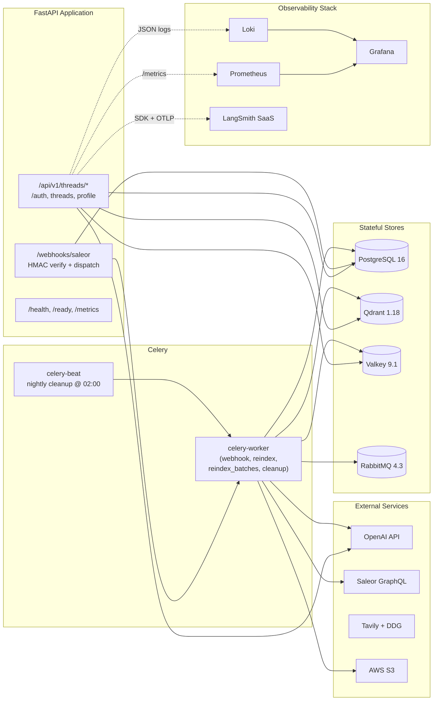
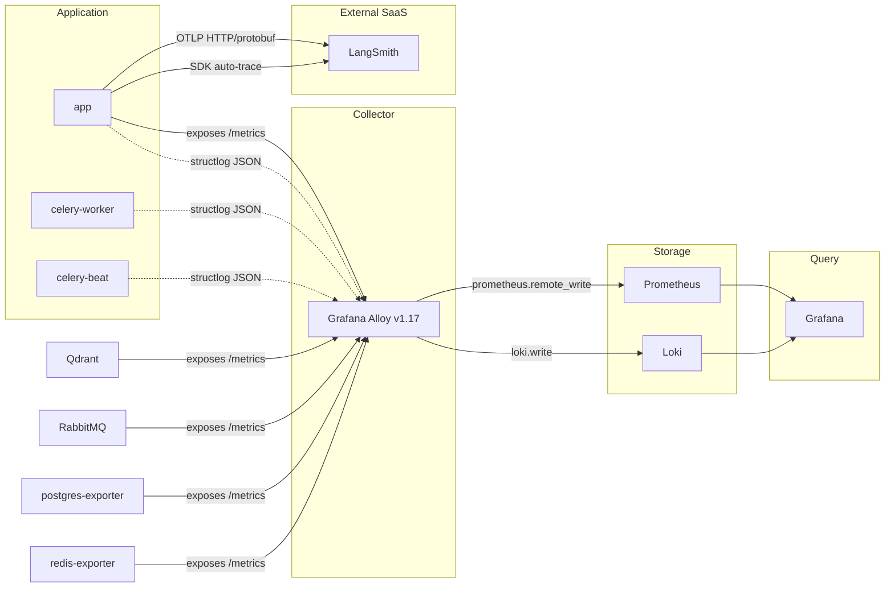

# Agentic RAG Ecommerce

**AI POD Stylist & Recommendation System** — a production-grade multi-agent AI consultant
built for the Print-on-Demand (POD) industry, integrated with the open-source
[Saleor](https://saleor.io/) e-commerce platform.

[](https://www.python.org/)
[](https://fastapi.tiangolo.com/)
[](https://langchain-ai.github.io/langgraph/)
[](https://www.llamaindex.ai/)
[](#)

---

## 1. Project Overview

The **POD Stylist** is a multi-agent AI microservice that acts as a **personal stylist**
for customers browsing a Print-on-Demand catalog. It understands customer needs through
multi-turn conversation, retrieves matching product blanks from a vector catalog,
searches the web for real-time design trends, generates on-demand design images, and
delivers personalised print design suggestions — all streamed to the browser in real
time.

### Why this project stands out

This codebase demonstrates end-to-end engineering across two domains that are often
implemented in isolation:

#### AI / Agent Engineering

- **Stateful multi-agent orchestration** with 8 LangGraph nodes plus 2 subagents
  (Product RAG + Trend Scout), conditional routing, parallel branches, and subagent
  loop-back for iterative retrieval.
- **Hybrid retrieval (RAG)** combining dense semantic vectors and sparse BM25 over
  Qdrant, with LLM-based reranking and metadata filtering.
- **Context engineering** — dynamic per-intent system prompts (externalised),
  incremental user-profile merging, automatic conversation summarisation, and
  per-turn context notes injected as local LLM messages without polluting persisted
  state.
- **Dual tracing** — LangSmith SDK auto-trace for LangChain/LangGraph + OpenInference
  OTel for LlamaIndex, converging into a single LangSmith project per request.
- **Tool-use safety** — bounded `recursion_limit`, explicit `update_intent` tool with
  a six-value taxonomy, prompt-injection guard rails, and graceful degradation when
  retrieval fails.

#### Backend Engineering

- **Production FastAPI** — lifespan-managed singletons, dependency injection via
  `app.state`, async-only I/O, typed Pydantic schemas.
- **Event-driven async processing** — Celery + RabbitMQ for webhook ingestion,
  batch reindex, and nightly cleanup, with HMAC-SHA256 verification and idempotent
  upserts.
- **Streaming first** — 7-event Server-Sent Events (SSE) protocol with structured
  payloads, backpressure via per-request queues, and graceful error reporting.
- **Layered architecture** — routes → services → repositories, each layer
  independently testable, with raw-SQL migrations via Alembic.
- **Observability built in** — structlog JSON, Prometheus metrics via
  `prometheus-fastapi-instrumentator`, LangSmith tracing, Loki + Grafana + Alloy
  pipeline, `correlation_id` propagated through every node.
- **Security by default** — Saleor JWT (RS256) with cached JWKS, HMAC-SHA256 webhook
  verification with constant-time compare, rate limiting per JWT subject, no secrets
  in source.

---

## 2. Main Features

### 2.1 Multi-Agent Architecture

The agent graph is composed of two subagent islands wired into a parent graph that
routes traffic by intent:

| Component | Role |
|---|---|
| **Orchestrator** | LLM-based intent classifier (six intents). Step-budget guard forces `fallback` when `remaining_steps <= AGENT_FALLBACK_THRESHOLD` to avoid hitting LangGraph's hard `recursion_limit`. |
| **ProductRAGAgent** | Hybrid retrieval subgraph — query rewriting in English, hybrid dense + sparse BM25 search over Qdrant, LLM-based rerank. Shared retry + timeout policies on every node. |
| **TrendScoutAgent** | ReAct loop with a single exposed `tavily_search` tool (DuckDuckGo is a private fallback helper, not a `@tool`). Returns structured `TrendScoutOutput`. `SummarizationMiddleware` keeps the message history bounded for long threads. |
| **Synthesizer** | Streams the final response with intent-specific system prompts (`synthesize_sufficient`, `synthesize_clarification`, `synthesize_out_of_scope`, `synthesize_fallback`) — each externalised under `src/app/agent/prompts/`. |
| **Profiler** | Incrementally merges long-term user attributes (`age_group`, `style_preferences`, `product_interests`, occasion) into the `AsyncPostgresStore` namespace `("profiles", user_id)` using only `{current_profile_json, latest_message}` — never the full history. |
| **Summariser** | When the message count exceeds `MESSAGE_SUMMARIZE_THRESHOLD`, the oldest `MESSAGE_SUMMARIZE_COUNT` messages collapse into a single `summary` injected back into the prompt. |
| **Title Generator** | Parallel branch from `START`; runs only on the first turn of a thread (no-op when `title_generated=True`). Up to `TITLE_GENERATION_MAX_ATTEMPTS` retries, with truncation fallback. |
| **Image Generator** | Parallel branch from `synthesize`. Calls `gpt-image-2` (default; configurable via `IMAGE_GENERATION_MODEL`), uploads base64 payload to AWS S3, enforces per-user daily quotas via a Valkey counter, inserts a `generated_images` row keyed by `request_message_id`. |

### 2.2 Hybrid Retrieval Pipeline (RAG)

The `ProductRAGAgent` is a 3-stage subgraph:

```
START → prepare_query_node → hybrid_search_node → llm_postprocess_node → END
```

| Stage | What it does |
|---|---|
| `prepare_query_node` | Rewrites the user query in English regardless of input language, then derives metadata filters (`category`, `price_range`, `tags`). |
| `hybrid_search_node` | Runs dense (semantic via OpenAI embeddings) + sparse (BM25 via FastEmbed `Qdrant/bm25`) against the Qdrant `products` collection, fuses with metadata filters, returns top-`QDRANT_HYBRID_TOP_K` candidates. |
| `llm_postprocess_node` | Reranks candidates using `RERANK_MODEL`, returns top-`QDRANT_RERANK_TOP_K` products with relevance reasoning. |

**Fault tolerance:** every node carries a shared `RetryPolicy(max_attempts=3)`,
`TimeoutPolicy(run_timeout=60, idle_timeout=30)`, and a per-node `error_handler` that
emits a `Command(update=..., goto=...)` so the subgraph always produces a well-shaped
`retrieved_products`.

### 2.3 Context Engineering

Three layers of context work in concert:

1. **Long-term memory (per user, across threads)** — `AsyncPostgresStore` keyed by
   user_id holds the merged customer profile. Used to personalise system prompts in
   `synthesize`.
2. **Short-term memory (per thread)** — `AsyncPostgresSaver` checkpoints `AgentState`
   after every node, so the conversation can resume mid-turn or replay exactly.
3. **Per-turn context notes** — the orchestrator and synthesiser build local
   `HumanMessage` blocks about `retrieved_products`, `trend_summary`, `image_prompt`,
   and `generate_image` flags. These are passed to the LLM only and **not returned**
   from the node, preventing the `add_messages` reducer from accumulating duplicates
   across loop iterations.

The summariser triggers when the message count exceeds the configured threshold and
injects the resulting summary into future prompts. All prompts are externalised under
`src/app/agent/prompts/` — no prompt text is embedded in orchestration code.

### 2.4 Event-Driven Backend

- **Webhook ingestion** — `POST /webhooks/saleor` validates the `Saleor-Signature`
  HMAC-SHA256 header against the raw request body using `hmac.compare_digest`
  (constant-time). Verified events dispatch an idempotent Celery task on the `webhook`
  queue within the 200 ms SLA (NFR-003). The endpoint is exempt from the global rate
  limiter (FR-094).
- **Batch reindex** — `POST /api/v1/admin/reindex` enqueues a chain of
  `process_batch` tasks on the `reindex_batches` queue. Each batch fetches products
  from Saleor via the GraphQL API, generates a vector description (concurrent LLM
  calls bounded by `DESCRIPTION_SUMMARIZE_CONCURRENCY`), embeds, and upserts to
  Qdrant.
- **Nightly cleanup** — Celery Beat fires `cleanup_expired_threads` at 02:00 UTC,
  deleting threads whose `last_message_at` is older than `THREAD_EXPIRY_DAYS`.

### 2.5 Real-Time Streaming (SSE)

All chat responses stream to the browser via Server-Sent Events with seven typed
events, each carrying a Pydantic-validated payload:

| Event | When |
|---|---|
| `token` | One per non-empty LLM chunk during `synthesize` |
| `products` | Emitted once after `synthesize` when `retrieved_products` is non-empty |
| `image_ready` | After S3 upload of an on-demand image |
| `image_failed` | On image quota exceeded or generation failure |
| `thread_title` | When `generate_title` produces a title (first turn only) |
| `done` | Terminal event with `run_id`, `intent`, token usage, and cost |
| `error` | Any pipeline error; closes the stream |

### 2.6 Observability

A unified tracing pipeline runs through every layer:

- **AI traces** — LangSmith (SaaS) receives both LangChain/LangGraph runs (via the
  `langsmith` SDK auto-trace) and LlamaIndex retrieval/embedding spans (via
  OpenInference OTLP HTTP/protobuf). Both paths converge in a single project per
  request, with `correlation_id` on the root run.
- **Logs** — `structlog` emits JSON to stdout in every container; the Alloy collector
  (Phase 2 rollout — see `docs/analysis/07-OBSERVABILITY-IMPLEMENTATION-PLAN.md`)
  parses, promotes `correlation_id` to a Loki label, and writes to Loki.
- **Metrics** — `prometheus-fastapi-instrumentator` exposes `/metrics` on the app;
  Alloy scrapes app, Qdrant, Postgres exporter, Valkey exporter, and RabbitMQ
  Prometheus plugin and remote_writes to Prometheus.
- **Dashboards** — Grafana is provisioned with non-AI dashboards (System Overview,
  Infrastructure, Logs Explorer, Business Metrics). AI/agent observability lives in
  LangSmith by design.

---

## 3. Tech Stack

| Layer | Technology |
|---|---|
| Language / Runtime | Python 3.12 |
| Web framework | FastAPI 0.136 + Uvicorn 0.48 + SSE |
| Agent orchestration | LangGraph 1.2 (`AsyncPostgresSaver` + `AsyncPostgresStore`), LangChain 1.3, `langsmith` 0.8 SDK |
| LLM provider | OpenAI (gpt-image-2 for images; model names fully configurable via env: `RESPONSE_MODEL`, `ORCHESTRATOR_MODEL`, `TITLE_MODEL`, `SUMMARIZE_MODEL`, `RERANK_MODEL`, `EMBEDDING_MODEL`) |
| RAG framework | LlamaIndex 0.14 (core, vector-stores-qdrant, embeddings-openai, retrievers-bm25) |
| Sparse retrieval | FastEmbed BM25 (`Qdrant/bm25` from Hugging Face Hub) |
| Vector database | Qdrant 1.18 (hybrid dense + sparse BM25 + metadata filters) |
| Relational database | PostgreSQL 16 (LangGraph checkpoint + custom `threads`, `generated_images` tables) |
| Cache / rate limiting | Valkey 9.1 (Redis-compatible) — DB/0 = rate limit, DB/1 = response cache, DB/2 = Celery results |
| Async tasks | Celery 5.6 + RabbitMQ 4.3 (webhook, reindex, reindex_batches, cleanup queues) |
| Image generation | OpenAI `gpt-image-2` (default) — `b64_json` payload, base64-decoded inline, uploaded to AWS S3 |
| Web search | Tavily (primary) with internal DuckDuckGo fallback helper (not exposed as `@tool`) |
| Authentication | Saleor JWT (RS256, JWKS-cached) for end users; HMAC-SHA256 for Saleor webhooks |
| Rate limiting | `slowapi` keyed on JWT `sub` claim (Valkey backend) |
| Caching | `fastapi-cache2` (Valkey backend) for thread-list responses |
| Observability | structlog 25.5 JSON + `prometheus-fastapi-instrumentator` 8.0 + LangSmith + OpenInference OTel + Grafana + Loki + (planned) Grafana Alloy |
| E-commerce backend | Saleor (open-source, GraphQL + HMAC-signed webhooks) |
| Dependency management | `uv` + `pyproject.toml` (hatchling build backend) |
| Linting / formatting | `ruff` (lint + format), line length 100 |
| Type checking | `pyright` standard mode |
| Testing | `pytest` + `pytest-asyncio` + `pytest-cov` (>= 80 % coverage required), `respx` for HTTP mocking, `fakeredis` for Valkey |
| Pre-commit | `pre-commit` (ruff + pyright gates) |
| Containerisation | Docker + Docker Compose (13 services) |
| CI | GitHub Actions |

---

## 4. LangGraph Graph Architecture

### 4.1 Graph Overview

The compiled graph is an 8-node parent with two subagent islands. The parent graph
maintains the conversation-level state, short-term memory, and dispatch logic; each
subagent owns its own transient subgraph state and exposes a single entry point that
the parent invokes as a node.



### 4.2 Node Descriptions

| Node | Type | Purpose | Key Behaviour |
|---|---|---|---|
| `profiler` | Plain async function | Merge long-term user profile | Reads `(current_profile_json, latest_message)` only — not full history. Writes to `AsyncPostgresStore` under namespace `("profiles", user_id)`. |
| `summarize` | Plain async function | Bound conversation memory | When `len(messages) > MESSAGE_SUMMARIZE_THRESHOLD`, the oldest `MESSAGE_SUMMARIZE_COUNT` messages are folded into `state["summary"]`; injects into future prompts. |
| `orchestrate` | Plain async function | LLM-based intent classifier | Single `ChatOpenAI(ORCHESTRATOR_MODEL).bind_tools([update_intent])` call. Forces `fallback` when `configurable.remaining_steps <= AGENT_FALLBACK_THRESHOLD`. Returns ONLY `{"intent": ...}` — never mutates `messages`. |
| `run_product_rag` | Subagent wrapper | Hybrid retrieval subgraph | Translates `AgentState` → `ProductRAGState`, invokes the cached compiled subgraph, maps `retrieved_products` back. Shared singleton `AsyncQdrantClient` injected via `config["configurable"]`. |
| `run_trend_scout` | Subagent wrapper | Trend research subagent | `create_agent` with `tools=[tavily_search]` only (DDG is internal fallback). `SummarizationMiddleware` keeps the message list bounded for very long threads. Returns `trend_summary` + `image_prompt`. |
| `synthesize` | Plain async function | Stream final response | Iterates `llm.astream(...)`; one `token` SSE event per non-empty chunk; intent-specific system prompt (`synthesize_sufficient` / `clarification` / `out_of_scope` / `fallback`). Emits `products`, terminal `done`, returns one `AIMessage` for state. |
| `generate_image` | Plain async function | Parallel image generation | Calls `openai.images.generate(model=IMAGE_GENERATION_MODEL, response_format="b64_json")`, base64-decodes inline, uploads to S3 via `S3Service`, writes `generated_images` row keyed by `request_message_id`, enforces per-user daily quota via Valkey. Emits `image_ready` / `image_failed`. |
| `generate_title` | Plain async function | Parallel thread naming | Runs as parallel branch from `START`. No-op when `state["title_generated"]` is true. Up to `TITLE_GENERATION_MAX_ATTEMPTS` retries with truncation fallback. Emits `thread_title`. |

### 4.3 Conditional Routing (`route_orchestrate`)

```python
def route_orchestrate(state: AgentState) -> str:
    intent = state.get("intent")
    if intent == "need_product_search":
        return "run_product_rag"
    if intent == "need_trend_info":
        return "run_trend_scout"
    # sufficient, clarification_needed, out_of_scope, fallback, None, unknown
    return "synthesize"
```

The same orchestrator node may run 2–4 times in a single turn (loop-back from each
subagent) until either `synthesize` is reached or the step budget runs out. Each loop
iteration appends a fresh `HumanMessage` context note describing what was retrieved
so the LLM can recognise whether to ask the subagent for more.

### 4.4 Intent Taxonomy

| Intent | Dispatched To | When |
|---|---|---|
| `need_product_search` | `run_product_rag` | Query references products, attributes, prices, or inventory |
| `need_trend_info` | `run_trend_scout` | Query references trends, styles, design ideas, or asks for an image |
| `sufficient` | `synthesize` | Enough context gathered — generate the final answer |
| `clarification_needed` | `synthesize` | Ask the user a focused clarifying question |
| `out_of_scope` | `synthesize` | Request outside the assistant's scope; respond gracefully |
| `fallback` | `synthesize` | Forced by step-budget guard or any unknown intent value |

### 4.5 Subagent Islands

#### ProductRAG subgraph



#### TrendScout subagent



---

## 5. System Architecture Overview

### 5.1 Container View



### 5.2 Data Flows

| Flow | Path |
|---|---|
| **Chat turn** | Saleor JWT → FastAPI middleware → `agent_state` → LangGraph `ainvoke` → SSE stream back to browser |
| **Webhook event** | Saleor → `POST /webhooks/saleor` → HMAC verify → `process_webhook.delay()` → Celery worker → `AsyncQdrantClient.upsert(...)` |
| **Reindex** | Admin `POST /api/v1/admin/reindex` → Celery chain → `SaleorClient.products_page(...)` → embedding → `QdrantService.upsert(...)` per batch |
| **Cleanup** | Celery Beat `@ 02:00` → `cleanup_expired_threads` → mark + delete threads older than `THREAD_EXPIRY_DAYS` |
| **Trend retrieval** | Orchestrator → `run_trend_scout` → Tavily search → structured `TrendScoutOutput` → `state["trend_summary"]` + `state["image_prompt"]` |
| **Image generation** | Synthesize emits parallel branch → `generate_image` → OpenAI `gpt-image-2` → base64 decode → S3 upload → `image_ready` SSE event |
| **Trace propagation** | API boundary generates `correlation_id` → bound to structlog context vars → forwarded to LangGraph `config["metadata"]` → surfaced on every LangSmith run + Loki log line |

### 5.3 Layered Architecture (Application Code)

```
src/app/
├── api/             # FastAPI routers — request/response only, no business logic
│   ├── chat.py      # SSE streaming endpoint
│   ├── threads.py   # Thread CRUD
│   ├── profile.py   # User profile reads
│   ├── admin.py     # Staff-only reindex / thread listing
│   ├── webhooks.py  # Saleor HMAC verify + Celery dispatch
│   └── health.py    # Liveness + readiness probes
├── agent/           # LangGraph orchestration
│   ├── graph.py             # Compiles the 8-node graph
│   ├── state.py             # AgentState TypedDict (MessagesState extension)
│   ├── nodes/               # Plain async node functions
│   ├── subagents/           # ProductRAG + TrendScout compiled subgraphs
│   └── prompts/             # Externalised .md prompt templates
├── services/        # Service layer — clients to external systems
│   ├── qdrant_service.py
│   ├── s3_service.py
│   ├── saleor_client.py
│   └── valkey_service.py
├── repositories/    # Data access — raw SQL via psycopg
├── tasks/           # Celery tasks (webhook, reindex, cleanup)
├── observability/   # structlog + LangSmith configuration
├── auth/            # JWT verify, HMAC verify, dependency factories
├── rag/             # LlamaIndex indexer (Qdrant collection bootstrap)
├── api/schemas/     # Pydantic request/response models
├── db/              # psycopg pool lifecycle
├── models/          # Internal dataclasses (Pydantic-free)
├── cache/           # fastapi-cache2 wiring
├── dependencies.py  # FastAPI dependency factories
├── rate_limit.py    # slowapi Limiter setup
├── config.py        # pydantic-settings Settings
└── main.py          # FastAPI app + lifespan context
```

**Rule:** each layer depends only on the layer below. Routes never call repositories
directly; they go through services. Services own the external clients
(`AsyncQdrantClient`, `AsyncOpenAI`, `boto3` S3 client). Repositories own raw SQL.

### 5.4 Observability Architecture

The observability plane is a single-pipeline design. Every log line and every
`/metrics` endpoint in the system is tailed or scraped by **Grafana Alloy** and
then fanned out to **Loki** (logs) and **Prometheus** (metrics). Traces are the
only signal that bypasses Alloy and are sent directly from the app to
**LangSmith** via SDK auto-instrumentation and OTLP HTTP/protobuf. **Grafana**
sits on top of Loki and Prometheus as the query and dashboard layer.



**Why a single collector.** Replacing the per-signal pipeline (one log
shipper, one metrics scraper, one trace exporter) with a single Alloy pipeline
keeps scrape configuration, label transforms, and remote-write endpoints in
one place. The `postgres-exporter` and `redis-exporter` sidecars exist because
Postgres and Valkey do not expose Prometheus metrics natively — they translate
internal stats into the Prometheus exposition format on `:9187/metrics` and
`:9121/metrics` respectively.

**Why traces bypass Alloy.** The LangSmith SDK is already auto-instrumented for
LangChain and LangGraph calls, and the OpenInference OTLP HTTP/protobuf
exporter is wired into the existing tracing context. Routing traces through
Alloy would add a hop, a second failure mode, and no value — the SDK's own
batching and retry already cover the use case.

---

## 6. Installation & Quick Start

### 6.1 Prerequisites

| Tool | Version |
|---|---|
| Docker Engine | 24+ |
| Docker Compose | v2 (bundled with Docker Desktop / `docker compose-plugin`) |
| `uv` | latest (only required if running tests outside Docker) |
| Python | 3.12 (only required outside Docker) |

### 6.2 Clone and Configure

```bash
git clone <repository-url> agentic-rag-ecommerce
cd agentic-rag-ecommerce
```

Copy the example environment file and fill in your secrets:

```bash
cp .env.example .env
```

Open `.env` and supply values for at minimum these keys (the rest have safe dev
defaults):

| Variable | Required | Notes |
|---|---|---|
| `OPENAI_API_KEY` | Yes | For LLM calls and image generation |
| `TAVILY_API_KEY` | Yes | For the TrendScout web search tool |
| `SALEOR_URL` | Yes | Base URL of your running Saleor instance |
| `SALEOR_APP_TOKEN` | Yes | Long-lived Saleor App token (see `docs/analysis/00-SALEOR-APP-WEBHOOK-SETUP.md`) |
| `SALEOR_WEBHOOK_SECRET` | Yes | 32+ char shared secret used to sign webhooks |
| `POSTGRES_PASSWORD` | Recommended | Override the `changeme` default |
| `AWS_ACCESS_KEY_ID` / `AWS_SECRET_ACCESS_KEY` | Yes (prod) | For S3 image storage |
| `AWS_S3_BUCKET` | Yes | Bucket name (auto-created on startup) |
| `LANGSMITH_API_KEY` | Recommended | For LangSmith tracing (optional but recommended in dev) |
| `LANGSMITH_TRACING` | Optional | Set `true` to enable LangSmith export |

### 6.3 Start the Stack

```bash
docker compose up -d
```

This brings up 13 services (see §6.4). First startup takes 2–4 minutes because Docker
pulls images, Alembic runs migrations, and Qdrant bootstraps the `products` collection.

### 6.4 Docker Services

| Service | Image | Purpose |
|---|---|---|
| `app` | Custom (`docker/app/Dockerfile`) | FastAPI application — listens on `:8080` |
| `celery-worker` | Custom | Consumes the `webhook`, `reindex`, `reindex_batches`, `cleanup` queues (concurrency 4) |
| `celery-beat` | Custom | Scheduler — fires nightly `cleanup_expired_threads` at 02:00 UTC |
| `postgres` | `postgres:16.14-alpine` | LangGraph checkpoint store + `threads` / `generated_images` tables |
| `qdrant` | `qdrant/qdrant:v1.18.1` | Vector store — hybrid dense + sparse BM25 over the `products` collection |
| `valkey` | `valkey/valkey:9.1.0-alpine` | Redis-compatible cache + rate-limit + Celery result backend |
| `rabbitmq` | `rabbitmq:4.3.1-management-alpine` | Celery broker; management UI on `:15672` |
| `prometheus` | `prom/prometheus:v3.4.0` | Metrics scrape + storage (15-day retention) |
| `grafana` | `grafana/grafana:13.0.2` | Provisioned with Loki + Prometheus datasources and dashboard folder |
| `loki` | `grafana/loki:3.7.2` | Log aggregation backend (single-process mode) |
| `alloy` | `grafana/alloy:v1.17.0` | Unified collector — tails container logs to Loki and scrapes every `/metrics` endpoint (app, Qdrant, RabbitMQ) to Prometheus remote-write |
| `redis-exporter` | `oliver006/redis_exporter` | Exposes Valkey metrics on `:9121/metrics` (Valkey is Redis-compatible) |
| `postgres-exporter` | `prometheuscommunity/postgres-exporter` | Exposes Postgres metrics on `:9187/metrics` |

> **Optional dev tools.** `docker compose --profile tools up -d` also brings up:
> `adminer` (Postgres UI on `:8081`) and `redis-insight` (Valkey UI on `:5540`).
> Qdrant's native dashboard lives at `:6333/dashboard`; RabbitMQ's management UI at
> `:15672`.

### 6.5 Local Development (Without Docker for the App)

```bash
# Install dependencies
uv sync

# Run unit tests
pytest

# Run with coverage gate (must stay >= 80 %)
pytest --cov=src/app

# Lint + format
ruff check .
ruff format .

# Type-check
pyright

# Run pre-commit gates
pre-commit run --all-files
```

---

## 7. Project Documentation

| Document | Role |
|---|---|
| [`docs/analysis/01-USE-CASE-ANALYSIS.md`](docs/analysis/01-USE-CASE-ANALYSIS.md) | Use cases (actors A-01..A-12, UC-001..UC-011) |
| [`docs/analysis/02-REQUIREMENTS-SPECIFICATION.md`](docs/analysis/02-REQUIREMENTS-SPECIFICATION.md) | Functional + non-functional requirements, env-var registry |
| [`docs/analysis/03-PROJECT-SCAFFOLD.md`](docs/analysis/03-PROJECT-SCAFFOLD.md) | Directory layout, dependency catalogue, Docker Compose reference |
| [`docs/analysis/04-MULTI-AGENT-ARCHITECTURE-DESIGN.md`](docs/analysis/04-MULTI-AGENT-ARCHITECTURE-DESIGN.md) | Agent topology, node designs, RAG pipeline design |
| [`docs/analysis/05-IMPLEMENTATION-PLAN.md`](docs/analysis/05-IMPLEMENTATION-PLAN.md) | Master plan — phases 1–14, audit, Definition of Done |
| [`docs/analysis/06-OBSERVABILITY-DESIGN.md`](docs/analysis/06-OBSERVABILITY-DESIGN.md) | Observability architecture — components, data flows |
| [`docs/analysis/07-OBSERVABILITY-IMPLEMENTATION-PLAN.md`](docs/analysis/07-OBSERVABILITY-IMPLEMENTATION-PLAN.md) | Observability phased rollout (LangSmith + Alloy + dashboards) |
| [`docs/analysis/00-SALEOR-APP-WEBHOOK-SETUP.md`](docs/analysis/00-SALEOR-APP-WEBHOOK-SETUP.md) | Saleor App + webhook registration walk-through |
| [`history/`](history/) | Decision records for every architectural choice |

---

## 8. License

Released under the [MIT License](LICENSE) — see [`LICENSE`](LICENSE) for the full text.

Copyright (c) 2026 Nguyễn Trung Tín.
