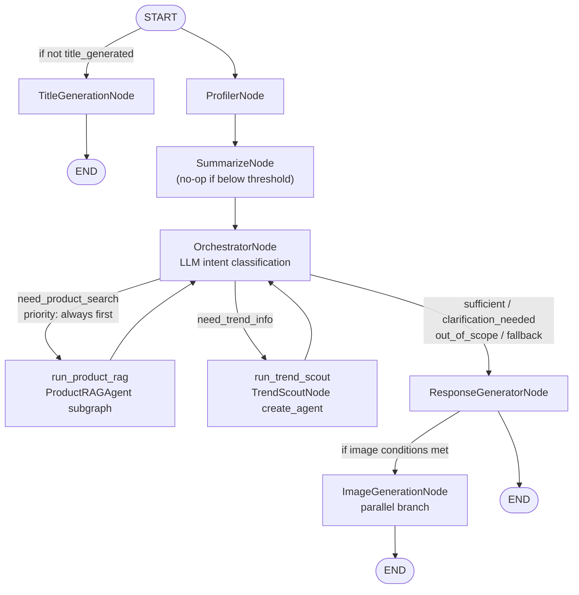

# Multi-Agent Architecture Design — AI POD Stylist

**Project**: `agentic-rag-ecommerce` — AI POD Stylist & Recommendation System
- **Version**: DRAFT 0.6
- **Date**: 2026-06-07
- **Status**: In Analysis — Draft under active discussion

> This is a working draft produced from the initial design sketch + LlamaIndex/LangGraph
> documentation research. Items marked [OPEN] are pending clarification from discussion.
> - DRAFT 0.2: Applied clarifications from session 2 (2026-06-06).
> - DRAFT 0.3: Added message summarization, subgraph isolation strategy (2026-06-06).
> - DRAFT 0.4: Fixed TrendScoutNode to use create_agent + state_schema; added context fields to subgraph states; added orchestrator product-first routing priority (2026-06-07).
> - DRAFT 0.5: Added SummarizeNode section and parent graph topology; rewrote TrendScoutNode (TrendScoutState simplified, TrendScoutOutput as structured output, dynamic SystemMessage for context injection); fixed OrchestratorNode pattern; fixed ProductRAGState messages type (2026-06-07).
> - DRAFT 0.6: Switched MetadataFilters to Option B — only `available` and `price_max` as filters; category/collections intent embedded in query text for hybrid search (2026-06-07).

---

## 1. Architecture Summary

The system uses a **stateful multi-agent graph** orchestrated by LangGraph. Seven nodes are wired
into a `StateGraph(AgentState)` with conditional routing. Each node is implemented using one of
three patterns based on complexity:

| Pattern | When to Use | Nodes Using It |
|---|---|---|
| LangGraph `StateGraph` (sub-graph, isolated state) | Complex internal retrieval pipeline with private state | `ProductRAGAgent` |
| LangChain `create_agent` with `state_schema` | ReAct tool-use loop with custom extended state fields | `TrendScoutNode` |
| LangGraph custom node (plain function wrapping compiled subgraph) | Wrapper node that transforms parent ↔ subgraph state | `run_product_rag`, `run_trend_scout` |
| Plain Python `async def` function | Fixed deterministic logic, no internal LLM loop | `ProfilerNode`, `TitleGenerationNode`, `ImageGenerationNode`, `ResponseGeneratorNode`, `SummarizeNode` |
| LangGraph conditional routing node | LLM classification + edge dispatch | `OrchestratorNode` |

### 1.1 Subgraph Isolation Strategy

Both subagents use the **"Call a subgraph inside a node"** pattern where a wrapper node
transforms parent `AgentState` into subgraph input, invokes the subgraph, and maps the
result back to the parent state. However, each subagent uses a different internal pattern:

| Subagent | Internal Pattern | Rationale |
|---|---|---|
| `ProductRAGAgent` | LangGraph `StateGraph` (custom pipeline) | Fixed sequential stages; no open-ended tool loop needed |
| `TrendScoutNode` | LangChain `create_agent` with `state_schema` | ReAct tool-use loop; LLM decides when to call search tools |

**State isolation rules**:
- Both subagents have their **own state class** containing only what they need
- `ProductRAGState` is a `TypedDict` (no `messages` reducer needed — pure pipeline)
- `TrendScoutState` extends LangChain `AgentState` (inherits `messages` + `add_messages` reducer)
- Neither subgraph's internal state keys collide with parent `AgentState`
- Wrapper nodes handle the full transformation: parent → subgraph input → parent update

**Context injection (middleware pattern)**:

Both subagents need conversation context from the parent state. The wrapper node acts as a
middleware layer, injecting context before invoking each subagent:

- **`TrendScoutNode`**: `summary`, `user_profile`, and `retrieved_products` are combined into a
  single **dynamic `SystemMessage`** built by the wrapper and prepended as `messages[0]`. The
  agent receives all context through its message history — no separate state fields needed for
  context. Only `generate_image` is kept as a `TrendScoutState` field for conditional output logic.
- **`ProductRAGAgent`**: `messages`, `summary`, and `user_profile` are passed as explicit fields
  in `ProductRAGState` so `prepare_query_node` can reference them directly when constructing
  the search query and extracting metadata filters.

```python
# Example: context injection in TrendScoutNode wrapper (dynamic SystemMessage)
def run_trend_scout(state: AgentState, config: RunnableConfig) -> dict:
    """Wrapper: builds dynamic SystemMessage with all context, invokes agent, maps structured output."""
    system_content = _build_trend_scout_system(
        summary=state.get("summary", ""),
        user_profile=state["user_profile"],
        retrieved_products=state.get("retrieved_products", []),
        generate_image=state["generate_image"],
    )
    subgraph_input = {
        "messages": [SystemMessage(content=system_content)] + list(state["messages"]),
        "generate_image": state["generate_image"],
    }
    result = trend_scout_agent.invoke(subgraph_input, config)
    output: TrendScoutOutput = extract_structured_output(result)
    return {
        "trend_summary": output.trend_summary,
        "image_prompt": output.image_prompt,
    }
```

**Subgraph checkpointer**: both compiled with `checkpointer=None` (per-invocation, default).
They inherit the parent's `AsyncPostgresSaver` for interrupt support but start fresh each call.

**Benefits**:
- Subgraph internal state (intermediate search results, raw candidates) never pollutes `AgentState`
- Subagents can be developed, tested, and replaced independently
- No risk of subgraph fields accidentally colliding with parent fields

---

### 1.2 Short-term Memory Management (Message Summarization)

Long conversations accumulate messages that eventually exceed the LLM context window and
increase inference cost. The system manages this with a **threshold-based summarization** strategy
instead of simple trimming (which loses information).

**Mechanism**:

```
After every turn: check len(state["messages"])
  If len >= MESSAGE_SUMMARIZE_THRESHOLD (default: 12 = 6 AI-human pairs):
    → Run SummarizeNode:
        1. Take the oldest MESSAGE_SUMMARIZE_COUNT (default: 8) messages
        2. Build summarization prompt:
           - If state["summary"] exists: "Extend this existing summary: {summary}\n\nNew messages to incorporate:"
           - Else: "Summarize this conversation:"
        3. LLM call (ORCHESTRATOR_MODEL) → new summary string
        4. Delete the 8 summarized messages from state["messages"] using RemoveMessage
        5. Write new summary to state["summary"]
```

**LangGraph implementation**:

```python
from langchain_core.messages import RemoveMessage

class AgentState(MessagesState):
    summary: str   # accumulated conversation summary
    # ... other fields

async def summarize_messages(state: AgentState) -> dict:
    summary = state.get("summary", "")
    messages = state["messages"]
    messages_to_summarize = messages[:MESSAGE_SUMMARIZE_COUNT]  # oldest 8

    if summary:
        prompt = (
            f"Existing summary: {summary}\n\n"
            "Extend the summary by incorporating the new messages above:"
        )
    else:
        prompt = "Create a summary of the conversation above:"

    response = await llm.ainvoke(messages_to_summarize + [HumanMessage(content=prompt)])
    delete_ops = [RemoveMessage(id=m.id) for m in messages_to_summarize]
    return {"summary": response.content, "messages": delete_ops}
```

**`summary` in context**: `ResponseGeneratorNode` injects `state["summary"]` into the
system prompt when it is non-empty, so the LLM always has full conversation context
even after old messages are removed.

**Key env vars**:

| Env Var | Default | Meaning |
|---|---|---|
| `MESSAGE_SUMMARIZE_THRESHOLD` | `12` | Trigger summarization when messages reach this count |
| `MESSAGE_SUMMARIZE_COUNT` | `8` | Number of oldest messages to summarize per run |

**Profile vs Summary — distinction**:

| | `user_profile` (LangGraph Store) | `summary` (AgentState) |
|---|---|---|
| What it stores | Extracted user attributes (style, occasions, budget) | Condensed conversation narrative |
| Scope | Persists across ALL threads for a user | Scoped to this thread only |
| Update trigger | Every turn (ProfilerNode) | When message count hits threshold |
| Used by | ProductRAGAgent (query context), TrendScoutNode (via dynamic SystemMessage), ResponseGeneratorNode | ResponseGeneratorNode (conversation context) |

---

### 1.3 Parent Graph Topology

Full wiring of the parent `StateGraph(AgentState)`:



**Wiring rules**:
- `START → profiler` and `START → title_generation` are **parallel** — both fire on every turn;
  `title_generation` is a no-op (early return) when `title_generated=True`
- `profiler → summarize → orchestrate` — always sequential; `summarize` is a no-op below threshold
- `orchestrate` has a **conditional edge** mapping `intent` → next node
- `run_product_rag` and `run_trend_scout` both **loop back** to `orchestrate` after completion
- `synthesize` (ResponseGeneratorNode) fans out to `image_generation` (parallel) AND `END`
- Loop termination: `OrchestratorNode` checks `config["remaining_steps"]` and forces
  `intent = "fallback"` before `recursion_limit` is reached

**LangGraph wiring sketch**:
```python
graph = StateGraph(AgentState)
graph.add_node("title_generation", title_generation_node)
graph.add_node("profiler", profiler_node)
graph.add_node("summarize", summarize_node)
graph.add_node("orchestrate", orchestrate_node)
graph.add_node("run_product_rag", run_product_rag)
graph.add_node("run_trend_scout", run_trend_scout)
graph.add_node("synthesize", response_generator_node)
graph.add_node("image_generation", image_generation_node)

graph.add_edge(START, "profiler")                     # main pipeline
graph.add_edge(START, "title_generation")             # parallel branch
graph.add_edge("title_generation", END)
graph.add_edge("profiler", "summarize")
graph.add_edge("summarize", "orchestrate")
graph.add_conditional_edges("orchestrate", route_orchestrate, {
    "run_product_rag": "run_product_rag",
    "run_trend_scout": "run_trend_scout",
    "synthesize": "synthesize",
})
graph.add_edge("run_product_rag", "orchestrate")
graph.add_edge("run_trend_scout", "orchestrate")
graph.add_edge("synthesize", "image_generation")
graph.add_edge("synthesize", END)
graph.add_edge("image_generation", END)
```

---

## 2. Node-by-Node Design

---

### 2.1 OrchestratorNode

**Pattern**: Plain `async def` function node with LLM tool binding

**Rationale**: The orchestrator makes a single LLM call with the `update_intent` tool bound to
produce a structured intent classification. It returns a state update (`AgentState.intent`) and
exits. All routing happens via **conditional edges** defined on the parent `StateGraph` — the
node contains no branching logic or ReAct loop. `config["remaining_steps"]` is checked inside
the node to force `intent = "fallback"` before the recursion budget is exhausted.

**LLM**: `ORCHESTRATOR_MODEL` (default: `gpt-5.4-mini`) — lightweight, cost-efficient for routing.

**Responsibilities**:
- Read `config["remaining_steps"]`; if `<= AGENT_FALLBACK_THRESHOLD` force intent = `fallback`
- Classify user intent into one of: `sufficient | clarification_needed | out_of_scope | need_product_search | need_trend_info | fallback`
- Write `AgentState.intent`
- Route via conditional edges to `ProductRAGAgent`, `TrendScoutNode`, or `ResponseGeneratorNode`

**Tool**: `update_intent` — a `@tool`-decorated function that writes the chosen intent into state.
This allows the LLM to signal intent as a structured tool call instead of free-form text parsing.

**Routing Logic** (conditional edges):

```
orchestrate() result:
  intent = "need_product_search"   → run_product_rag
  intent = "need_trend_info"       → run_trend_scout
  intent = "sufficient"            → synthesize
  intent = "clarification_needed"  → synthesize
  intent = "out_of_scope"          → synthesize
  intent = "fallback"              → synthesize
```

**Loop Control**:
- `ProductRAGAgent` and `TrendScoutNode` both route back to `orchestrate` after completion
- `MAX_AGENT_STEPS` (env var) maps to LangGraph `recursion_limit` — hard ceiling
- `AGENT_FALLBACK_THRESHOLD` (env var, default: 2) — graceful degradation threshold before hitting ceiling

**[RESOLVED Q-1]**: The orchestrator always runs **sequentially** — one sub-agent per iteration.
After each sub-agent completes, control returns to `orchestrate` for re-evaluation. This keeps
state transitions predictable and avoids race conditions on `AgentState`.

**Dispatch priority rule (embedded in orchestrator system prompt)**:
> When a user query requires both product recommendations AND design trend information,
> the orchestrator MUST dispatch `need_product_search` first. Only after `retrieved_products`
> is populated does it dispatch `need_trend_info`. This ordering ensures the trend agent
> has access to already-retrieved products as context when formulating its search query,
> and avoids redundant retrieval on subsequent turns.

Example turn sequence where both product search and trend info are needed:
```
orchestrate → (need_product_search) → run_product_rag → orchestrate
  → (need_trend_info) → run_trend_scout → orchestrate
  → (sufficient) → synthesize
```

---

### 2.2 TrendScoutNode

**Pattern**: LangChain `create_agent` with `state_schema=TrendScoutState`, wrapped by a plain
node function in the parent graph.

**Rationale**: TrendScoutNode uses a ReAct tool-use loop — the LLM autonomously decides
when to call search tools and how many times. `create_agent` with a custom `state_schema`
is the correct fit: it provides the ReAct loop natively while allowing custom fields
(user context, conversation summary) to be passed as structured state. A wrapper node in
the parent graph handles the parent ↔ subgraph state transformation (see Section 1.1).

**Subgraph state** (`TrendScoutState` extends LangChain `AgentState`):
```python
from langchain.agents import AgentState  # has messages + add_messages reducer

class TrendScoutState(AgentState):
    # messages: list[BaseMessage] — inherited; messages[0] is the dynamic SystemMessage
    # containing: summary + user_profile + retrieved_products (built by wrapper node)
    generate_image: bool  # whether to include a text-to-image prompt in the output
```

**Structured output** (`TrendScoutOutput` — returned by the agent, NOT a state field):
```python
class TrendScoutOutput(BaseModel):
    trend_summary: str           # 2-3 sentence trend report
    image_prompt: str | None     # 1 text-to-image prompt; None if not applicable
```

**`create_agent` instantiation**:
```python
from langchain.agents import create_agent

trend_scout_agent = create_agent(
    model=settings.orchestrator_model,
    tools=[tavily_search, duckduckgo_search],
    state_schema=TrendScoutState,
    # System prompt instructs agent to return TrendScoutOutput as its final structured response.
    # All context (summary, user_profile, retrieved_products) is in messages[0] — the dynamic
    # SystemMessage built by the wrapper node. No separate state fields needed for context.
)
```

**`_build_trend_scout_system` helper** (called by wrapper node):
```python
def _build_trend_scout_system(
    summary: str,
    user_profile: dict,
    retrieved_products: list[dict],
    generate_image: bool,
) -> str:
    """Build dynamic system message injecting all context from parent AgentState."""
    import json
    parts = ["You are a fashion trend analyst for a Print-on-Demand store.\n"]
    if summary:
        parts.append(f"## Conversation history summary\n{summary}\n")
    if user_profile:
        parts.append(f"## User preferences\n{json.dumps(user_profile, ensure_ascii=False)}\n")
    if retrieved_products:
        names = [p.get("name", p.get("product_id", "?")) for p in retrieved_products]
        parts.append(f"## Products already recommended\n{', '.join(names)}\n")
    if generate_image:
        parts.append("## Output note\nInclude exactly one text-to-image prompt in your response.\n")
    return "\n".join(parts)
```

**LLM**: `ORCHESTRATOR_MODEL` (default: `gpt-5.4-mini`)

**Tools** (both defined as `@tool`):

| Tool | Provider | Notes |
|---|---|---|
| `tavily_search` | Tavily Python SDK (`TavilySearchResults`) | Primary, configurable `max_results` |
| `duckduckgo_search` | `duckduckgo-search` (`DuckDuckGoSearchRun`) | Fallback when Tavily fails or quota exceeded |

**Internal Flow**:
```
Wrapper builds dynamic SystemMessage: summary + user_profile + retrieved_products + generate_image flag
  → Prepends SystemMessage to state["messages"] → passes to trend_scout_agent
  → create_agent ReAct loop:
      LLM reads context from SystemMessage (messages[0]) + recent conversation messages
      LLM calls tavily_search (primary) or duckduckgo_search (fallback on error/quota)
      LLM synthesizes result → returns TrendScoutOutput (structured response):
          trend_summary: 2-3 sentence trend report
          image_prompt: 1 prompt if generate_image=True and query is design-related, else None
  → Wrapper maps TrendScoutOutput → parent AgentState update:
      { "trend_summary": output.trend_summary, "image_prompt": output.image_prompt }
```

**Agent output** (`TrendScoutOutput` — two separate typed fields, not an embedded string format):
- `trend_summary` — 2-3 sentences covering: top POD design themes, trending color palettes,
  relevant styles for the query. Written as a concise analyst report.
- `image_prompt` — exactly 1 descriptive text-to-image prompt (e.g. suitable for DALL-E),
  populated only when `generate_image=True` AND the query is design-related; `None` otherwise.

The wrapper maps these directly to `AgentState.trend_summary` and `AgentState.image_prompt`.
No string parsing or section splitting needed.

**Fallback strategy**: Tavily is tried first. If `TavilyToolException` or quota error is raised,
the agent retries with `duckduckgo_search`. If both fail, `trend_summary` is set to `None` and
the orchestrator routes to `ResponseGeneratorNode` without trend data.

**[RESOLVED Q-2]**: Search is **not domain-restricted** by topic. POD customers cover unlimited
theme categories (sports, anime, nature, politics, family, etc.). The LLM formulates the search
query freely from user context.

However, the following **content guardrails apply** to generated design suggestions and prompts
(enforced by a system prompt instruction in the TrendScoutNode and the ResponseGeneratorNode):
- No content that violates law or regulations
- No content that infringes copyright or trademarks (e.g., specific character names, logos, brand marks)
- No content that violates community standards (hate speech, explicit content, violence)

---

### 2.3 ProductRAGAgent

**Pattern**: LangGraph custom `StateGraph` sub-graph (fixed sequential pipeline), wrapped by
a plain node function in the parent graph.

**Rationale**: The retrieval pipeline has fixed sequential stages with no open-ended tool loop.
A hand-built `StateGraph` gives explicit control over each stage. Uses "Call a subgraph inside
a node" pattern (see Section 1.1) for state isolation. A wrapper node handles context injection
and state transformation.

**Internal Pipeline**:

```
START
  → prepare_query_node    (LLM call: query rewrite to English + metadata extraction)
  → hybrid_search_node    (LlamaIndex + Qdrant: dense + sparse BM25)
  → llm_postprocess_node  (LLM filter: top-K products by relevance)
  → END  (subgraph result mapped back to parent: { retrieved_products: [...] })
```

**Subgraph state** (`ProductRAGState`):
```python
class ProductRAGState(TypedDict):
    # Context injected by wrapper node (from parent AgentState)
    messages: list[BaseMessage]       # recent conversation messages (for query context)
    summary: str                      # conversation summary (for broader context)
    user_profile: dict                # user profile (for personalization + budget filter)
    # Pipeline fields
    query: str                        # English search query (output of prepare_query_node)
    filters: dict | None              # metadata filter dict
    candidates: list[dict]            # raw NodeWithScore from Qdrant
    retrieved_products: list[dict]    # final filtered ProductPayload list (output)
```

**Context injection**: the wrapper passes `messages`, `summary`, and `user_profile` from
`AgentState` into `ProductRAGState`. `prepare_query_node` uses all three to build a
richer, more personalized English search query and extract relevant metadata filters.

**Stage 1 — prepare_query_node**:
- Input: `ProductRAGState.messages` (recent conversation), `ProductRAGState.summary`
  (full history digest), `ProductRAGState.user_profile` (personalization + budget context)
- LLM call (`ORCHESTRATOR_MODEL`) extracts:
  - `query: str` — English search query (required; translated if needed — FR-040).
    Category, style, and collection intent are embedded directly into the query text
    so hybrid search handles them semantically (avoids exact-match mismatch risk).
  - `metadata_filter: dict | None` — only predictable scalar fields are used as hard filters:
    ```python
    {
        "available": True,          # optional — matches ProductPayload.available (bool)
        "price_max": 250000.0,      # optional — compared against ProductPayload.price_max (float)
    }
    # NOTE: category and collections are intentionally excluded from MetadataFilters.
    # LLM has no reliable knowledge of exact catalog values → exact-match filter
    # risks returning zero results. Category/style intent goes into query text instead.
    ```
- Uses structured output (`response_format=BaseModel`) to guarantee parseable result

**Stage 2 — hybrid_search_node**:
- Uses `QdrantVectorStore` from `llama-index-vector-stores-qdrant` with `enable_hybrid=True`
- Sparse model: `"Qdrant/bm25"` via fastembed (built-in, no separate service needed)
- Dense model: `OpenAIEmbedding(model=EMBEDDING_MODEL)` (default: `text-embedding-3-small`)
- Search config (all top-k values configurable via env vars — RESOLVED Q-4):
  ```python
  query_engine = index.as_query_engine(
      vector_store_query_mode="hybrid",
      sparse_top_k=settings.qdrant_sparse_top_k,        # env: QDRANT_SPARSE_TOP_K (default: 12)
      similarity_top_k=settings.qdrant_similarity_top_k, # env: QDRANT_SIMILARITY_TOP_K (default: 12)
      hybrid_top_k=settings.qdrant_hybrid_top_k,        # env: QDRANT_HYBRID_TOP_K (default: 9)
      filters=metadata_filters,  # MetadataFilters from prepare_query stage
  )
  ```
- `QDRANT_RERANK_TOP_K` (default: 3) — number of products returned after LLM post-processing
- Fusion algorithm: Relative Score Fusion (default in LlamaIndex QdrantVectorStore)

- Metadata filter API (Option B — scalar fields only):
  ```python
  from llama_index.core.vector_stores import MetadataFilter, MetadataFilters, FilterOperator, FilterCondition

  filters = MetadataFilters(
      filters=[
          MetadataFilter(key="available", operator=FilterOperator.EQ, value=True),
          MetadataFilter(key="price_max", operator=FilterOperator.LTE, value=250000.0),
      ],
      condition=FilterCondition.AND,
  )
  # category and collections are NOT filtered here — handled semantically by hybrid search
  ```

**Stage 3 — llm_postprocess_node** (Custom Node Post-Processor):

**LLM**: `RERANK_MODEL` (dedicated env var — NOT `ORCHESTRATOR_MODEL`).
Rationale: reranking is a distinct task from routing, allowing independent cost/quality tuning.

- Input: `QDRANT_HYBRID_TOP_K` raw `NodeWithScore` results (with full `ProductPayload` metadata)
- Single task: **filter** — select the `QDRANT_RERANK_TOP_K` most relevant products from candidates
  based on relevance to user intent, profile context, occasion, style fit
- LLM output (structured): `list[str]` — ordered list of selected `product_id` values
- After LLM call: map each `product_id` back to the original `ProductPayload` (all fields
  preserved as-is from Qdrant). No description rewriting happens here.
- Final output: `list[ProductPayload]` with original content, length = `QDRANT_RERANK_TOP_K`

> Description is dialed to user context at response synthesis time, not at retrieval time.
> `ResponseGeneratorNode` receives the full `ProductPayload` list and the LLM naturally
> references and re-frames product descriptions within the conversational response.

**Output**: `AgentState.retrieved_products` — list of `ProductPayload` objects (default: 3)

**[RESOLVED Q-3]**: Price is stored as two separate numeric fields `price_min: float` and
`price_max: float` (native currency amount from Saleor's `pricing.priceRange`). This enables
direct numeric metadata filtering in Qdrant. A separate `price_range: str` field is also
stored for human-readable display in SSE `products` events. `currency` is stored as an
ISO 4217 code (e.g. `"VND"`, `"USD"`) taken from the same Saleor pricing response.

**[RESOLVED Q-4]**: All top-k values are configurable via environment variables:

| Env Var | Default | Controls |
|---|---|---|
| `QDRANT_SPARSE_TOP_K` | `12` | Nodes retrieved via sparse BM25 |
| `QDRANT_SIMILARITY_TOP_K` | `12` | Nodes retrieved via dense vectors |
| `QDRANT_HYBRID_TOP_K` | `9` | Nodes after Relative Score Fusion (input to LLM postprocess) |
| `QDRANT_RERANK_TOP_K` | `3` | Final products after LLM filter |

---

### 2.4 ProfilerNode

**Pattern**: Plain `async def` function

**Rationale**: Fixed logic — load profile from store, call LLM with compact 2-field prompt,
merge result back to store. No branching or tool calls needed.

**LLM**: `SUMMARIZE_MODEL` — profile extraction is a compact, lightweight generation task;
no routing intelligence needed. Using a dedicated model allows independent cost tuning.

**Flow**:
```
1. Load profile from AsyncPostgresStore: get(("profiles", user_id), user_id)
2. LLM call with ONLY:
   - current_profile_json: str  (current profile snapshot)
   - latest_user_message: str   (current turn message)
3. LLM returns merged/updated profile (structured output: UserProfile)
4. Write back to store: put(("profiles", user_id), user_id, updated_profile)
5. Update AgentState.user_profile
```

**Profile schema** (`UserProfile`):
```python
class UserProfile(BaseModel):
    age_group: str | None          # "teen", "young_adult", "adult", "senior"
    style_preferences: list[str]   # ["minimalist", "floral", "streetwear"]
    product_interests: list[str]   # ["t-shirt", "mug", "canvas"]
    occasion_context: str | None   # "birthday", "christmas", "self-purchase"
    recipient_context: str | None  # "mom", "friend", "self"
    budget_range: str | None       # free text, e.g. "under 200k VND", "200k-500k"
```

**[RESOLVED Q-5]**: `budget_range` is stored as **free text** (e.g. `"under 200k VND"`,
`"500k to 1 million"`). The LLM extracts this naturally from conversation. At query time,
the `prepare_query_node` LLM interprets the free-text budget to derive a numeric `price_max`
filter when needed — no rigid normalization required in the profile itself.

---

### 2.5 SummarizeNode

**Pattern**: Plain `async def` function — always in path after `ProfilerNode`; no-op when
threshold is not met (early return `{}`).

**Position in graph**: `ProfilerNode → SummarizeNode → OrchestratorNode` (every turn)

**Trigger**: Internal conditional check inside the node — no separate conditional edge needed:

```python
async def summarize_node(state: AgentState) -> dict:
    if len(state["messages"]) < settings.message_summarize_threshold:
        return {}  # below threshold: no-op, pass through unchanged
    # ... summarization logic ...
```

**When threshold is met** (`len(state["messages"]) >= MESSAGE_SUMMARIZE_THRESHOLD`, default: 12):

```
1. Select oldest MESSAGE_SUMMARIZE_COUNT messages (default: 8)
2. Build prompt:
   - If state["summary"] != "":
       "Existing summary: {summary}\n\nExtend by incorporating the new messages above:"
   - Else:
       "Create a summary of the conversation above:"
3. LLM call (ORCHESTRATOR_MODEL) → new summary string
4. Build delete ops: [RemoveMessage(id=m.id) for m in oldest_messages]
5. Return: {"summary": new_summary, "messages": delete_ops}
```

**LLM**: `SUMMARIZE_MODEL` — summarization is a simple generation task; no heavy model needed.

**State changes produced**:
- `summary: str` — overwritten with the new merged/extended summary
- `messages` — oldest `MESSAGE_SUMMARIZE_COUNT` entries removed via `RemoveMessage` reducer

After this node, `state["messages"]` contains only the most recent messages, while
`state["summary"]` carries the full condensed history. All downstream nodes
(`OrchestratorNode`, `ProductRAGAgent`, `TrendScoutNode`, `ResponseGeneratorNode`)
access the full context via `state["summary"]`.

---

### 2.6 TitleGenerationNode

**Pattern**: Plain `async def` function, runs as **parallel branch** on first run only

**LLM**: `TITLE_MODEL` (default: `gpt-5.4-nano`)

**Trigger condition**: `AgentState.title_generated == False` (checked at graph entry)

**Flow**:
```
1. Check thread.title_generated from DB — if True, node is skipped (returns immediately)
2. LLM call with: first_user_message → generate title ≤ 6 words
3. On success:
   - UPDATE threads SET title=..., title_generated=true, title_generation_attempts=N
   - Emit SSE: {"event": "thread_title", "data": {"title": "..."}}
   - Invalidate Valkey cache key: threads:{user_id}:*
4. On failure:
   - Increment title_generation_attempts counter
   - If attempts < TITLE_GENERATION_MAX_ATTEMPTS: return (retry on next run)
   - If attempts >= TITLE_GENERATION_MAX_ATTEMPTS:
       title = first_user_message[:TITLE_TRUNCATION_LENGTH]
       UPDATE threads SET title=..., title_generated=true
       Emit SSE: {"event": "thread_title", "data": {"title": "..."}}
```

---

### 2.7 ImageGenerationNode

**Pattern**: Plain `async def` function, runs as **parallel branch** after `ResponseGeneratorNode`

**Trigger conditions** (ALL must be true):
1. `generate_image: true` in the HTTP request body
2. Latest user message references design or imagery (detected by orchestrator)
3. `AgentState.trend_summary` is not None OR user message contains explicit design description

**Flow**:
```
1. Check Valkey quota: image_quota:{user_id}:{YYYY-MM-DD}
   - If >= IMAGE_DAILY_LIMIT → emit SSE image_failed {reason: "rate_limit_exceeded"} → return
2. Synthesize DALL-E prompt from trend_summary and/or user description
   - User description takes priority over trend suggestions (FR-049)
3. Call OpenAI DALL-E API (openai.images.generate)
4. Upload result to S3: images/{user_id}/{thread_id}/{timestamp}.png
5. INSERT into generated_images: {request_message_id=HumanMessage.id, url=s3_url, ...}
6. Increment Valkey counter with 24h TTL
7. Emit SSE: {"event": "image_ready", "data": {"url": "...", "prompt": "..."}}
On any DALL-E error → emit SSE image_failed {reason: "generation_failed"}
```

---

### 2.8 ResponseGeneratorNode

**Pattern**: Plain `async def` function with SSE streaming

**LLM**: `RESPONSE_MODEL` (default: `gpt-5.4`) — heavier model for quality responses

**Flow**:
```
1. Build system prompt from:
   - user_profile (personalization context)
   - retrieved_products (if any — formatted as structured list)
   - trend_summary (if any)
   - intent (to adjust tone: clarification / out_of_scope / fallback / sufficient)
2. Stream LLM response token by token → emit SSE "token" events
3. When streaming products: emit SSE "products" event (block separator with structured data)
4. After full response: emit SSE "done" event with run_id, intent, token usage, cost_usd
```

**SSE stream pattern** (interleaved block model per FR-069):
```
[token events: intro text...]
[products event: structured product list]
[token events: follow-up text...]
[done event]
```
(image_ready arrives async via ImageGenerationNode parallel branch, may arrive mid-stream)

---

## 3. RAG Ingestion Pipeline Design

### 3.1 TextNode Construction

Each Saleor product is transformed into ONE `TextNode` per product (not chunked further —
products are short structured data, not long documents).

**Text content** (embedded as dense vector):
```python
node_text = f"{product.name}\n\n{product_description_for_embedding}"
```

**Two-track `description` rule** (FR-035 + FR-035a): the indexer maintains a
**strict separation** between the description that gets embedded and the
description that gets stored in the Qdrant metadata payload. They may differ
in length when the cleaned description exceeds `DESCRIPTION_MAX_CHARS`.

| Track | Variable | Value | Length |
|---|---|---|---|
| Embedding text (input to `EMBEDDING_MODEL`) | `product_description_for_embedding` | `cleaned_text` if `len(cleaned) <= DESCRIPTION_MAX_CHARS`, else `SUMMARIZE_MODEL(cleaned_text)` | Bounded by `DESCRIPTION_MAX_CHARS` (or less after summarization) |
| Metadata payload (stored in Qdrant point, returned to `ResponseGeneratorNode` via `ProductPayload.description`) | `product_description_full` | `cleaned_text` (HTML-stripped, full length) | **Unbounded** — the full cleaned text |

**Description handling**: Raw Saleor description can be long HTML/rich text. Before indexing:
- Strip HTML tags → `cleaned_text`.
- `cleaned_text` is stored verbatim in `metadata["description"]` (FR-035).
- For the embedding text only: if `len(cleaned_text) > DESCRIPTION_MAX_CHARS` (default 500),
  summarize via LLM call using **`SUMMARIZE_MODEL`** (new dedicated env var — NOT
  `ORCHESTRATOR_MODEL`) to extract core content + important keywords.  This improves
  embedding quality by removing filler and preserving semantic signal.  Otherwise use
  `cleaned_text` as-is.
- The metadata `description` is **never** summarized or truncated; only the embedding
  text is.

**Why a separate `SUMMARIZE_MODEL`?** Description summarization during ingestion is a batch,
offline task (Celery worker context). It has different latency tolerance and cost profile from
online routing tasks. A dedicated env var allows using a cheaper model (e.g. `gpt-5.4-mini`) or
a different provider without affecting online agents.

**[RESOLVED Q-6]**: `DESCRIPTION_MAX_CHARS = 500`. Rationale: `text-embedding-3-small`
performs best for retrieval at **128–512 tokens**. 500 characters ≈ 150–200 tokens after
tokenization — within the optimal range. Descriptions longer than 500 characters are
summarised by `SUMMARIZE_MODEL` to preserve key semantic signal without diluting the vector.
The cap applies **only to the embedding text**; the metadata `description` is always full
length so the `ResponseGeneratorNode` can re-frame the original product copy verbatim.

**Metadata payload** stored in Qdrant point (used for metadata filtering AND
returned to the agent as `ProductPayload`):
```python
TextNode(
    text=node_text,  # embedded: name + (summary if long, else full) description
    id_=product.id,  # Saleor product ID as node_id (enables idempotent upserts)
    metadata={
        "product_id": product.id,
        "name": product.name,
        "description": cleaned_text,                  # FULL cleaned text (no length cap)
        "slug": product.slug,
        "category": product.category.name,           # e.g. "T-Shirts"
        "collections": [c.name for c in product.collections],  # e.g. ["Spring 2025", "Sale"]
        "price_min": price_range_start.gross.amount, # float, native currency amount
        "price_max": price_range_stop.gross.amount,  # float, native currency amount
        "currency": price_range_start.gross.currency, # e.g. "VND"
        "price_range": price_range_display,          # e.g. "100k – 250k VND" (display only)
        "available": product.is_available,           # bool
        "saleor_url": f"{settings.saleor_storefront_url}/products/{product.slug}/",
        "thumbnail_url": product.thumbnail.url,      # WEBP 512px
    },
)
```

**Field notes**:
- `description` in metadata is the **full** cleaned text (HTML stripped, length not
  bounded by `DESCRIPTION_MAX_CHARS`).  It is NEVER the summarized variant — the
  `ProductPayload.description` field returned by Qdrant always matches the original
  product copy.  Summarization only ever happens on the input side of the embedding
  model.
- `collections` replaces `tags`. Saleor has no native `tags` field on `Product`.
  Collections represent curated groupings (e.g. seasonal campaigns, promotions).
- `price_min` / `price_max` are native float amounts from `pricing.priceRange`.
  `price_range` (string) is derived at ingestion for display; never used for filtering.
- `saleor_url` is built at ingestion time using `SALEOR_STOREFRONT_URL` env var + `slug`.
- The text that gets embedded is plain text: EditorJS JSON is parsed block by block,
  concatenating `paragraph` and `header` block text values, then summarised if over
  `DESCRIPTION_MAX_CHARS`.  The metadata `description` receives the same block-by-block
  concatenation **without** the summarization step.

### 3.2 IngestionPipeline

```python
from llama_index.core.ingestion import IngestionPipeline
from llama_index.embeddings.openai import OpenAIEmbedding
from llama_index.vector_stores.qdrant import QdrantVectorStore

pipeline = IngestionPipeline(
    transformations=[
        # Step 1: No SentenceSplitter — one node per product (already structured)
        # Step 2: Embed with OpenAI dense model
        OpenAIEmbedding(model=settings.embedding_model),
        # Sparse (BM25) vectors are generated automatically by QdrantVectorStore
        # via fastembed when enable_hybrid=True — no separate transformation needed
    ],
    vector_store=vector_store,  # QdrantVectorStore with enable_hybrid=True
)
```

**Why no SentenceSplitter?**
Product data is short and structured. Chunking would split `name + description` into
meaningless fragments. Each product should be one atomic retrieval unit.

**Why no TitleExtractor / SummaryExtractor from LlamaIndex?**
LlamaIndex's built-in `SummaryExtractor` is designed for long documents. For products,
we perform a custom description summarization step during `TextNode` construction (see above)
before the pipeline runs, so no additional extractor is needed inside the pipeline.

**Idempotency**: `node.id_ = product.id` ensures Qdrant upsert semantics — re-processing
the same product always overwrites the same point (FR-080).

**Async pipeline** (for Celery workers):
```python
nodes = await pipeline.arun(nodes=[text_node])
```

### 3.3 Collection Configuration

The Qdrant collection must be pre-configured with BOTH dense and sparse vector configs
before the first insert:

```python
from qdrant_client import models

client.recreate_collection(
    collection_name="products",
    vectors_config={
        "text-dense": models.VectorParams(
            size=settings.embedding_dims,   # default 1536 for text-embedding-3-small
            distance=models.Distance.COSINE,
        )
    },
    sparse_vectors_config={
        "text-sparse": models.SparseVectorParams(
            index=models.SparseIndexParams()
        )
    },
)
```

> NOTE: LlamaIndex requires the dense vector name = `"text-dense"` and sparse = `"text-sparse"`
> when using hybrid mode with pre-configured collections.

---

## 4. AgentState Fields (Confirmed + Additions)

```python
class AgentState(MessagesState):
    # --- Core (FR-057) ---
    messages: list[BaseMessage]      # inherited from MessagesState, add_messages reducer
    summary: str                     # accumulated conversation summary (empty string = no summary yet)
    user_profile: dict               # serialized UserProfile JSON
    retrieved_products: list[dict]   # list of ProductPayload dicts
    trend_summary: str | None        # formatted trend report, or None
    thread_title: str | None         # proposed/finalized title
    correlation_id: str              # per-request UUID4

    # --- Routing & Control ---
    user_id: str                     # from JWT
    thread_id: str                   # current thread UUID
    intent: str | None               # orchestrator classification result
    title_generated: bool            # loaded from threads table at run start
    fallback_count: int              # consecutive fallback turns
    image_url: str | None            # S3 URL after image generation
    image_prompt: str | None         # text-to-image prompt from TrendScoutNode (1 prompt)
    generate_image: bool             # from HTTP request body
    first_user_message: str | None   # first HumanMessage text (for title gen)
```

**Notes**:
- `summary` is a plain `str`, default empty string `""`. `MessagesState` does not need
  a custom reducer for this field — it is overwritten on each summarization.
- `trend_summary` no longer contains the text-to-image prompt (moved to `image_prompt`).
  It contains only the trend report text.

---

## 5. Open Questions Summary

| ID | Node | Question | Status |
|---|---|---|---|
| Q-1 | Orchestrator | Sequential vs parallel dispatch for RAG + Trend? | RESOLVED: Sequential |
| Q-2 | TrendScout | Domain-restrict search queries? | RESOLVED: No restriction; content guardrails apply |
| Q-3 | ProductRAG + Indexer | How to store price for numeric filtering? | RESOLVED: `price_min` + `price_max` as float; `price_range` string for display only |
| Q-4 | ProductRAG | Are top-k values configurable via env vars? | RESOLVED: Yes — 4 separate env vars |
| Q-5 | Profiler | Store budget as structured or free text? | RESOLVED: Free text |
| Q-6 | Indexer | `DESCRIPTION_MAX_CHARS` threshold value? | RESOLVED: 500 chars (~150-200 tokens, optimal for text-embedding-3-small) |
| Q-7 | ImageGen + API | How does parallel ImageGen branch communicate SSE events back to HTTP stream? | RESOLVED: `asyncio.Queue` per request |

---

## 6. New Environment Variables (from this session)

The following env vars are **new** — not yet present in `src/app/config.py` or `02-REQUIREMENTS-SPECIFICATION.md`:

| Env Var | Default | Used By | Purpose |
|---|---|---|---|
| `MESSAGE_SUMMARIZE_THRESHOLD` | `12` | `SummarizeNode` | Message count that triggers summarization |
| `MESSAGE_SUMMARIZE_COUNT` | `8` | `SummarizeNode` | Number of oldest messages to summarize per run |
| `RERANK_MODEL` | `gpt-5.4-mini` | `llm_postprocess_node` | LLM for product reranking |
| `SUMMARIZE_MODEL` | `gpt-5.4-mini` | `ProfilerNode`, `SummarizeNode`, `ProductIndexer` (Celery) | LLM for profile extraction, message summarization, and product description summarization at ingestion |
| `QDRANT_SPARSE_TOP_K` | `12` | `hybrid_search_node` | Sparse BM25 candidate count |
| `QDRANT_SIMILARITY_TOP_K` | `12` | `hybrid_search_node` | Dense vector candidate count |
| `QDRANT_HYBRID_TOP_K` | `9` | `hybrid_search_node` | Post-fusion candidate count (input to LLM postprocess) |
| `QDRANT_RERANK_TOP_K` | `3` | `llm_postprocess_node` | Final product count after LLM filter |
| `DESCRIPTION_MAX_CHARS` | `500` | `ProductIndexer` (Celery) | Threshold above which description is summarized |
| `SALEOR_STOREFRONT_URL` | `""` | `ProductIndexer` (Celery) | Base URL for building `saleor_url` in Qdrant payload |

These must be added to `Settings` in `config.py` before Phase 5 implementation begins.

---

## 7. Implementation Notes & Constraints

- **fastembed** (`Qdrant/bm25` sparse model) runs locally inside the app container — no
  separate service needed. First run downloads the model (~80 MB). Must be included in Docker
  image build or pre-downloaded in startup.
- **Hybrid search requires `enable_hybrid=True` from the very first index creation.** Cannot
  add sparse vectors to an existing dense-only collection without recreating it.
- **LangGraph sub-graph for ProductRAGAgent and TrendScoutNode**: each sub-graph is compiled
  with `checkpointer=None` (per-invocation, default). They inherit the parent's
  `AsyncPostgresSaver` for interrupt support but start fresh on each call — no accumulated
  sub-graph state across turns. Wrapper node functions handle state transformation.
- **Parallel branches** (TitleGen + main pipeline; ImageGen + ResponseGen) use LangGraph's
  `add_node` + parallel `START` edges pattern. Both branches converge at `END` or at the
  `AsyncPostgresSaver` checkpoint.
- **SSE streaming from ResponseGeneratorNode**: FastAPI `StreamingResponse` + async generator.
  All nodes (ResponseGeneratorNode, ImageGenerationNode, TitleGenerationNode) communicate with
  the SSE generator via a **per-request `asyncio.Queue`** passed through LangGraph
  `config["configurable"]["sse_queue"]`.

  **[RESOLVED Q-7]**: `asyncio.Queue` is the correct mechanism because:
  - `ImageGenerationNode` and the SSE generator are both coroutines in the **same uvicorn
    async event loop** — they share process memory.
  - The API handler creates one `Queue` per request, passes it into the graph via `config`,
    and the SSE generator reads from it in a loop until a `None` sentinel is received.
  - LangGraph nodes call `await sse_queue.put(event)` to push events; the SSE generator
    calls `await sse_queue.get()` and yields them to the HTTP client immediately.
  - The queue acts as a **realtime pipe**, not a storage buffer — events flow through with
    near-zero latency. Backpressure is handled automatically.
  - Valkey pub/sub would be needed only if the app scaled to multiple uvicorn processes
    (workers) — not required at this stage.
- **`RERANK_MODEL` and `SUMMARIZE_MODEL`** are separate from `ORCHESTRATOR_MODEL` and
  `RESPONSE_MODEL`. All four can point to the same OpenAI model (e.g. `gpt-5.4-mini`) by default,
  but separating them enables independent cost/quality tuning per task.
