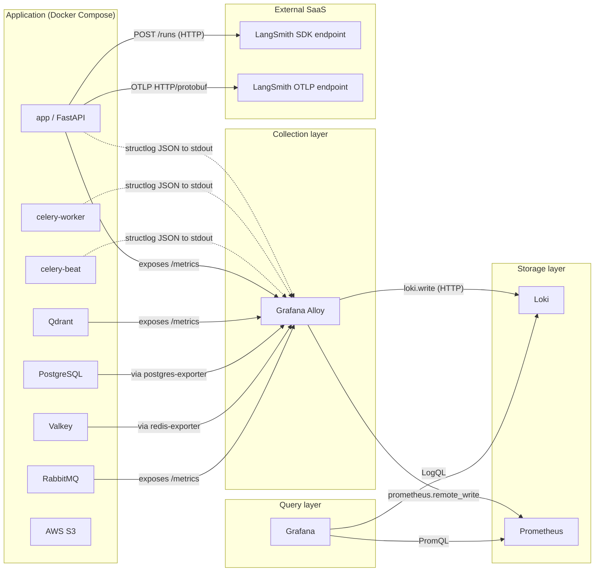
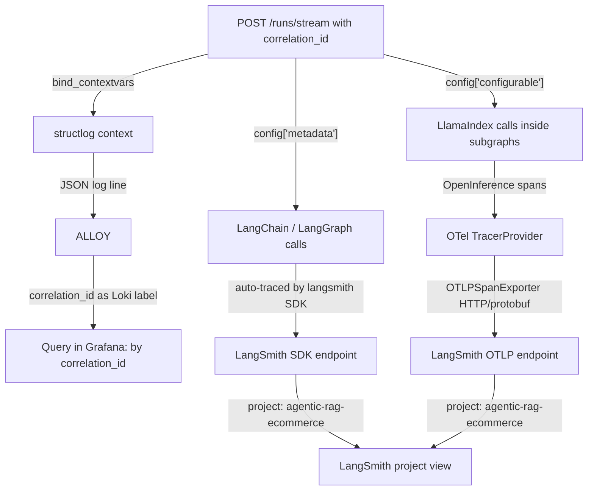
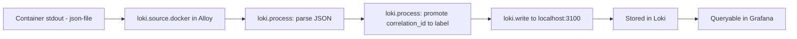
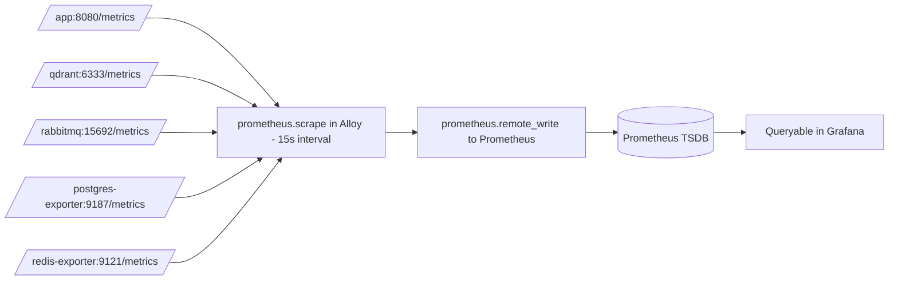

# Observability Design — AI POD Stylist

**Project**: `agentic-rag-ecommerce` — AI POD Stylist & Recommendation System
- **Version**: 1.0
- **Date**: 2026-06-17
- **Status**: Active — design locked, implementation tracked in [07-OBSERVABILITY-IMPLEMENTATION-PLAN.md](07-OBSERVABILITY-IMPLEMENTATION-PLAN.md)

> **Scope of this document** — the architecture of the observability stack:
> which components exist, what data they handle, how they communicate, and
> what each component owns. For the phased rollout plan, decisions D1–D10,
> and per-phase tasks see
> [07-OBSERVABILITY-IMPLEMENTATION-PLAN.md](07-OBSERVABILITY-IMPLEMENTATION-PLAN.md).
> For the working draft that produced this design see
> [temp/observability-redesign.md](../../temp/observability-redesign.md).
> For the implementation status of the wider project see
> [05-IMPLEMENTATION-PLAN.md](05-IMPLEMENTATION-PLAN.md).

---

## 1. Goals and Non-Goals

### 1.1 What Observability Must Enable

| Goal | Why It Matters |
|---|---|
| Debug a single user chat turn end-to-end | When a customer reports a bad recommendation, we must pivot from a single `correlation_id` to every LLM call, retrieval query, log line, and timing involved. |
| Detect infrastructure degradation before customers feel it | Qdrant vector count dropping, Valkey memory pressure, RabbitMQ queue depth growing — all need to be visible without SSH-ing into containers. |
| Track AI/LLM behaviour and cost | The orchestrator's intent dispatch, the synthesize stream, the on-demand image generation calls — all must be inspectable in LangSmith with token usage and full prompts. |
| Correlate logs with traces and HTTP requests | One `correlation_id` ties together: the HTTP request, every LangGraph node span in LangSmith, and every structlog JSON log line in Loki. |
| Keep operator workflows simple | One collector (Alloy) for both logs and metrics, one query interface (Grafana), one AI trace UI (LangSmith). |

### 1.2 Non-Goals (Out of Scope for the Whole Stack)

- **Self-hosted tracing backends** (Tempo, Jaeger, ClickHouse) — LangSmith SaaS is the only trace backend.
- **Multi-tenant log routing** — single-tenant dev/staging/prod split is enough; no per-customer log streams.
- **Long-term log archival to S3 / Glacier** — Loki retention is bounded (168h default).
- **Alerting rules and PagerDuty** — dashboards first; alerts are a follow-up after Phase 4 ships.
- **Distributed tracing across multiple FastAPI replicas** — current deployment is single-process; not a concern yet.
- **LLM cost / spend dashboards in Grafana** — LangSmith holds token usage; cost dashboards live there, not in Prometheus.

---

## 2. The Four Pillars

The observability stack is split into four orthogonal pillars. Each pillar has one canonical storage backend and one canonical query surface.

| Pillar | Storage Backend | Query Surface | Owns |
|---|---|---|---|
| AI / LLM traces | LangSmith SaaS | `smith.langchain.com` | Every LLM call, retrieval span, tool call, agent loop |
| Logs | Loki (single-process) | Grafana Explore (LogQL) | Application logs, Celery logs, container stdout |
| Metrics | Prometheus | Grafana Explore (PromQL) | HTTP latency, infra metrics, Qdrant/Postgres/Valkey/RabbitMQ counters |
| Dashboards | Grafana | Grafana home (UI) | Visualizations of logs + metrics; 4 non-AI dashboards |

The collector layer is the **fifth** component, not a pillar: **Grafana Alloy** sits between the running services and the storage backends, owning both log scraping and metrics scraping.

### 2.1 Pillar Split: AI Goes to LangSmith, Everything Else Goes to Grafana

The split is intentional and load-bearing. LangSmith understands prompts, tokens, agent loops, and tool calls; it cannot aggregate a fleet of infrastructure metrics. Grafana understands time-series, histograms, and high-cardinality labels; it cannot decode a structured LLM response into a token-cost view.

The boundaries:

| Concern | Owner |
|---|---|
| Per-node LangGraph latency, retry counts | LangSmith (in the trace tree) |
| Per-node LLM token usage, cost | LangSmith (run metadata) |
| Retrieval query hit rate, top-k quality | LangSmith (OpenInference spans from LlamaIndex) |
| HTTP request rate, error rate, latency percentiles | Grafana (from `prometheus_fastapi_instrumentator`) |
| Container CPU / memory | Grafana (from `cAdvisor` if added, or per-service metrics) |
| Qdrant / Postgres / Valkey / RabbitMQ health | Grafana (Phase 3) |
| Celery task success/failure | Grafana (Phase 2 logs + Phase 3 RabbitMQ queue depth) |
| Customer-facing business counters | Grafana (Phase 4, scraped from app `/metrics` endpoint) |

---

## 3. Component Inventory

### 3.1 Application Layer (in `src/app/`)

| Component | File | Role |
|---|---|---|
| `configure_logging` | `src/app/observability/logging.py` | structlog JSON setup, context-var binding for `correlation_id` |
| `configure_tracing` | `src/app/observability/tracing.py` | Builds the OTel `TracerProvider`, attaches the OTLP HTTP exporter, wires `LlamaIndexOpenInferenceInstrumentor` to the same provider |
| `instrumentator` | `src/app/main.py` (lifespan) | `prometheus_fastapi_instrumentator` mounted at `/metrics` for HTTP metrics |
| structlog `bind_contextvars` | Every agent node | Binds `correlation_id`, `thread_id`, `user_id` to async context — every log line in that context is auto-tagged |
| LangGraph `config["metadata"]` | `src/app/api/chat.py` | Forwards `correlation_id`, `thread_id`, `user_id` to every LangChain/LangGraph call — auto-traced by `langsmith` SDK |

### 3.2 Container Layer (in `docker-compose.yml`)

| Service | Image | Role |
|---|---|---|
| `loki` | `grafana/loki:3.7.2` | Log store. Single-process mode (no `loki/` config dir needed; default `local-config.yaml` is fine) |
| `prometheus` | `prom/prometheus` | Metric store. Becomes a pure remote-write target (no scrape jobs of its own after Phase 3) |
| `grafana` | `grafana/grafana` | Query surface for logs + metrics. Datasources and dashboards provisioned from files |
| `alloy` | `grafana/alloy:v1.17.0` | **Unified collector.** Scrapes Docker logs for Loki, scrapes `/metrics` endpoints for Prometheus |
| `redis-exporter` | `oliver006/redis_exporter` (Valkey-compatible) | Exports Valkey metrics on `:9121/metrics` |
| `postgres-exporter` | `prometheuscommunity/postgres-exporter` | Exports Postgres metrics on `:9187/metrics` |

External services with native Prometheus endpoints (no sidecar needed):

| Service | Endpoint |
|---|---|
| `qdrant` | `:6333/metrics` (native in v1.18.1) |
| `rabbitmq` | `:15692/metrics` (via `rabbitmq_prometheus` plugin) |

### 3.3 External / SaaS

| Service | Endpoint | Auth |
|---|---|---|
| LangSmith SDK ingestion | `https://aws.api.smith.langchain.com` | `LANGSMITH_API_KEY` (env var, `lsv2_pt_*` personal key) |
| LangSmith OTLP ingestion | `https://aws.api.smith.langchain.com/otel/v1/traces` | `x-api-key` header (same key), `Langsmith-Project` header |

---

## 4. Communication Flows

### 4.1 Container View (C4 Level 2)

### 4.2 Trace Flow (Two Paths to LangSmith)

The two paths converge in the same LangSmith project. An operator inspecting a single `correlation_id` sees both: the LangChain orchestration tree (auto-traced) and the LlamaIndex retrieval/embedding spans (OpenInference) interleaved by timestamp.

### 4.3 Log Flow

`correlation_id` is set by `structlog.contextvars.bind_contextvars(correlation_id=...)` at the API boundary (see [src/app/api/chat.py:132](../app/api/chat.py)) and propagates through every node via async context. The Loki label promotion makes per-request log queries O(1) instead of full-text scans.

### 4.4 Metric Flow

After Phase 3, the standalone Prometheus has **no scrape jobs of its own** — it is a pure remote-write target. All scraping is owned by Alloy. This keeps the scrape config in one declarative file (`config.alloy`) and avoids config drift between the two services.

---

## 5. Data Inventory

### 5.1 What We Collect and Where It Lives

| Data | Source | Format | Storage | Retention |
|---|---|---|---|---|
| LLM spans (LangChain) | `langsmith` SDK auto-trace | Runs JSON | LangSmith SaaS | LangSmith plan default |
| LLM spans (LlamaIndex) | OpenInference instrumentor | OTel spans | LangSmith OTLP ingestion | LangSmith plan default |
| Per-request log trail | structlog + stdlib | JSON to stdout | Loki | 168h (7 days) configurable |
| HTTP request metrics | `prometheus_fastapi_instrumentator` | Prometheus exposition | Prometheus | TSDB default (15 days) |
| Qdrant vectors / search QPS | Qdrant native exporter | Prometheus exposition | Prometheus | TSDB default |
| Postgres connections / tx | `postgres_exporter` | Prometheus exposition | Prometheus | TSDB default |
| Valkey memory / hit rate | `redis_exporter` (Valkey-compatible) | Prometheus exposition | Prometheus | TSDB default |
| RabbitMQ queue depth | `rabbitmq_prometheus` plugin | Prometheus exposition | Prometheus | TSDB default |

### 5.2 Tags and Labels We Standardize On

These appear in multiple pillars and are the cross-pillar join keys.

| Tag / Label | Pillars | Where It's Set |
|---|---|---|
| `correlation_id` | traces (LangSmith metadata), logs (Loki label) | [src/app/api/chat.py:132](../app/api/chat.py) — `bind_contextvars` + `config["metadata"]` |
| `thread_id` | traces (LangSmith metadata), logs (JSON field, not label) | [src/app/api/chat.py:133](../app/api/chat.py) |
| `user_id` | traces (LangSmith metadata), logs (JSON field) | [src/app/api/chat.py:134](../app/api/chat.py) |
| `service` | logs (Loki label) | Alloy relabel rule from Docker container labels |
| `endpoint` | logs (JSON field), metrics (Prometheus label) | [src/app/api/chat.py:135](../app/api/chat.py) |
| `service.name`, `service.version`, `deployment.environment` | OTel resource attributes | `configure_tracing` in `tracing.py` |
| `intent` | traces (LangSmith run metadata) | OrchestratorNode — see [analysis/04-MULTI-AGENT-ARCHITECTURE-DESIGN.md](04-MULTI-AGENT-ARCHITECTURE-DESIGN.md) |
| `model` | traces (LangSmith run metadata) | Every LLM-call node |

### 5.3 The Cardinality Budget

`correlation_id` is a UUID4 — one label series per request. At 20 requests/minute over 168 hours that is ~200k active series just for the app service. Loki can handle that, but it is the largest cardinality source in the system. Mitigation if storage becomes a problem: hash-truncate `correlation_id` to its first 8 hex chars at the Alloy `loki.process` stage (loses uniqueness, keeps correlation within an 8-char window — acceptable for short-window debugging).

---

## 6. Cross-Cutting Concerns

### 6.1 The `correlation_id` Threading

`correlation_id` is the single most important cross-pillar key. The threading rules:

1. **API boundary**: `src/app/api/chat.py:131` generates a UUID4 once per request.
2. **structlog context**: bound via `bind_contextvars` at the API boundary; every subsequent log line in the same async context inherits the binding.
3. **LangGraph config**: placed in `config["metadata"]` (auto-promoted to LangSmith run metadata) and `config["configurable"]` (so every node that reads `configurable.correlation_id` gets the same value).
4. **Loki**: promoted from JSON log field to a Loki label by Alloy's `loki.process` stage — every log line carrying the binding becomes queryable by `correlation_id`.
5. **LangSmith**: auto-mapped from `metadata.correlation_id` by the SDK; visible as a tag on the root run and inherited by every child run.

The rule: any log line or span without a `correlation_id` is a bug — it means the context was lost somewhere in the agent graph.

### 6.2 Container Logging Driver

`json-file` (Docker default) — Alloy reads the Docker socket to scrape container stdout. We do NOT use the `loki` Docker logging driver. Rationale:

- `docker logs <container>` keeps working for ad-hoc operator debugging.
- The scrape is the collector's problem (Alloy), not the container's.
- The default driver is well-tested and stable across Docker versions.
- Switching to `loki` driver couples container lifecycle to the Loki container — a crash in Loki breaks log capture on the next container start.

This is locked as decision D5 in [07-OBSERVABILITY-IMPLEMENTATION-PLAN.md §2](07-OBSERVABILITY-IMPLEMENTATION-PLAN.md).

### 6.3 OpenTelemetry Resource Attributes

`configure_tracing` sets three resource attributes on the global TracerProvider:

- `service.name=agentic-rag-ecommerce`
- `service.version=1.0.0` (read from `Settings.app_version` or a constant)
- `deployment.environment=development` (or whatever value `LANGSMITH_PROJECT` is set to)

These appear on every OTel span. LangSmith reads them and surfaces them in the trace tree — useful for filtering traces by environment when the same project receives dev + prod traces.

### 6.4 What Does NOT Go on the Observability Stack

A short list of things explicitly excluded (consistent with the project-wide "no infrastructure-as-code in app code" rule):

- **Alert rules and notification routes** — owned by a follow-up phase, not by this design.
- **Synthetic probes / uptime checks** — the FastAPI `/health` and `/ready` endpoints exist but no external probe pings them in this design.
- **User-facing SLA dashboards** — out of scope; this design targets operator visibility, not customer-facing reporting.
- **PII redaction in transit** — structlog never logs the raw `message` body or JWT content; the design relies on the application to redact at the source, not on Loki/Alloy to redact in transit.

---

## 7. Failure Modes and Operator Runbooks

### 7.1 What to Check When "I Can't See Anything"

| Symptom | First Check | Likely Cause |
|---|---|---|
| No traces in LangSmith | `echo $LANGSMITH_TRACING` in `app` container | Flag is `false` or `LANGSMITH_API_KEY` is missing/invalid |
| No LlamaIndex spans in LangSmith (only LangChain ones) | OTel exporter error in app logs | `OTEL_EXPORTER_OTLP_ENDPOINT` set wrong, or `OTEL_EXPORTER_OTLP_HEADERS` missing `x-api-key` |
| No logs in Loki | `docker logs agentic-rag-alloy` | Alloy container down, or `loki.source.docker` relabel rules dropping the container |
| No metrics in Grafana | `prometheus_targets` in Prometheus UI | Alloy scrape config error, or the target service is not exposing `/metrics` on the expected port |
| Logs arrive but `correlation_id` filter returns nothing | `loki.process` stage config | JSON parse failed; check `loki.process` is parsing the structlog output format correctly |

### 7.2 What to Check When Something Is Slow

| Symptom | First Check | Likely Cause |
|---|---|---|
| Chat turn latency is high | LangSmith trace → which span is widest? | A specific node (RAG, trend, synthesize) is slow — see that node's prompt or its external call |
| Postgres is the bottleneck | Phase 3 dashboard → `pg_stat_activity_count` | Connection pool exhausted; check `app.state` lifespan pool config |
| Qdrant is the bottleneck | Phase 3 dashboard → `qdrant_search_duration_seconds` | Vector count grew past index; check if reindex is needed |
| Loki queries are slow | Loki `/metrics` → `loki_query_duration_seconds` | Label cardinality too high; check `correlation_id` series count |

---

## 8. References

| Document | Purpose |
|---|---|
| [07-OBSERVABILITY-IMPLEMENTATION-PLAN.md](07-OBSERVABILITY-IMPLEMENTATION-PLAN.md) | Phased rollout plan, decisions D1–D10, per-phase tasks |
| [05-IMPLEMENTATION-PLAN.md](05-IMPLEMENTATION-PLAN.md) | Master implementation plan, project status |
| [04-MULTI-AGENT-ARCHITECTURE-DESIGN.md](04-MULTI-AGENT-ARCHITECTURE-DESIGN.md) | Agent topology — names the nodes that emit traces |
| [03-PROJECT-SCAFFOLD.md](03-PROJECT-SCAFFOLD.md) | Directory layout, Docker Compose, environment variables |
| [00-SALEOR-APP-WEBHOOK-SETUP.md](00-SALEOR-APP-WEBHOOK-SETUP.md) | Saleor webhook configuration (events traced by Phase 7) |
| [temp/observability-redesign.md](../../temp/observability-redesign.md) | Working draft that produced this design |
| [src/app/observability/tracing.py](../app/observability/tracing.py) | The single function that wires LangSmith + LlamaIndex tracing |
| [src/app/observability/logging.py](../app/observability/logging.py) | structlog JSON setup |
| [src/app/api/chat.py](../app/api/chat.py) | Where `correlation_id` is generated and threaded |
| LangSmith docs | External — OpenTelemetry endpoint, attribute mapping |
| Grafana Alloy docs | External — `loki.source.docker`, `prometheus.scrape` reference |
